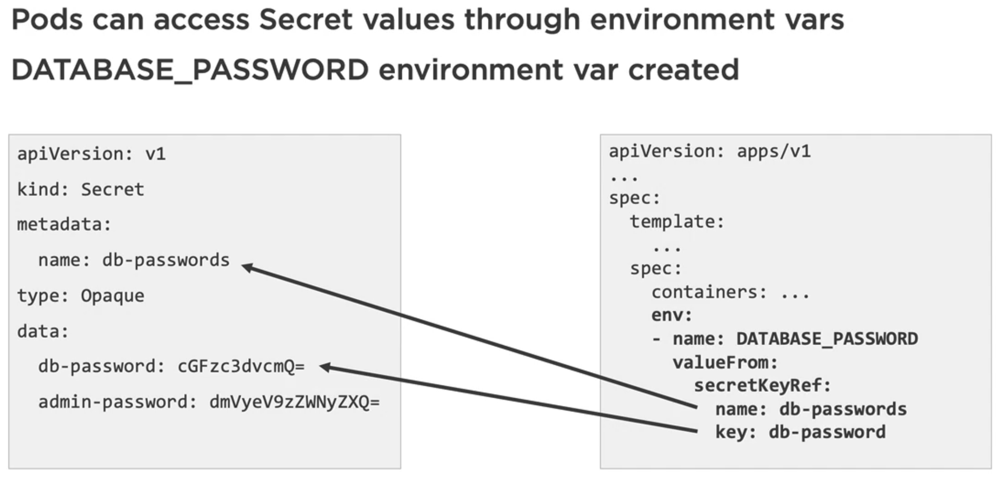
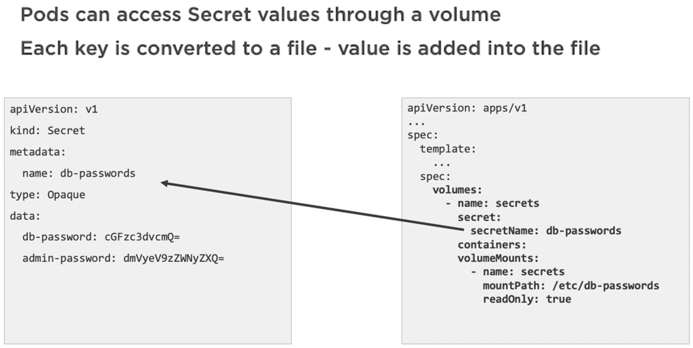

# ConfigMaps and Secrets

## ConfigMaps

A [ConfigMaps](https://kubernetes.io/docs/concepts/configuration/configmap/) is an API object used to store non-confidential data in key-value pairs. Pods can consume ConfigMaps as environment variables, command-line arguments using `kubectl` command, or as configuration files stored in a Volume. ConfigMap helps us to decouple environment-specific configuration from the container images, so that the applications are easily portable.

> It is important to take a note, that the ConfigMaps don't support secrecy / encryption. We should not use it store things like sensitive data or credentials. A dedicated K8s object called [Secret](https://kubernetes.io/docs/concepts/configuration/secret/) is there for that purpose.

The declarative approach to use a YAML for ConfigMaps is often referred to as a ConfigMap manifest. Following is an example of such a declaration. This can be used with K8s API using the usual commands like `k create -f <config_manifest_yaml> --save-config` or simply `k apply -f <config_manifest_yaml>`.

```yaml
apiVersion: v1
kind: ConfigMap # It is a COnfigMap kind of object
metadata:
  name: game-settings # Name metadata would be important as we'd see later, that we need it to get the configuration information
  labels:
    app: game-settings
data: # Data stores the actual configuration data, that we are interested in
  # Property-like keys; each key maps to a simple value
  player_initial_lives: "3"
  ui_properties_file_name: "user-interface.properties"

  # File-like keys
  game.properties: |
    enemy.types=aliens,monsters
    player.maximum-lives=5
  user-interface.properties: |
    color.good=purple
    color.bad=yellow
    allow.text_mode=true
```

Another approach to store configuration data is to use a config file kept in a Volume. This can be any file with name like game.cfg or game.config. This kind of configuration can also be used with K8s API like this, `k create configmap <config_map_name> --from-file=<config_file_path>`.

```config
enemies=aliens
lives=3
enemies.cheat=true
enemies.cheat.level=npGoodRotten
```

Using config file as above would lead to slightly different behavior than expected. It would lead K8s creating a manifest for us, which would look like below. Assuming, that we have mentioned the ConfigMap name as game-settings and the file name as game.config while invoking the command,

```yaml
apiVersion: v1
kind: ConfigMap
metadata:
  name: game-settings # Name is taken from the command line argument
data:
  game.config:
    | # This is interesting, as the file name becomes the key for the configuration
    enemies=aliens
    lives=3
    enemies.cheat=true
    enemies.cheat.level=npGoodRotten
```

Third option to create ConfigMap is to use a `.env` file. This is somewhat similar to, what we saw for the config file but the manifest it would create is slightly different than that of config file. The env file can look like below and the command we'd use for that is `k create configmap <config_map_name> --from-env-file=<env_file_path>`.

```env
<!-- As we see, the way to provide the key and values are exactly same as of config file -->
enemies=aliens
lives=3
enemies.cheat=true
enemies.cheat.level=npGoodRotten
```

The manifest, in which the env file would result in, looks like below.

```yaml
apiVersion: v1
kind: ConfigMap
metadata:
  name: game-settings # Name is taken from the command line argument
data: # The data would get the configuration key and values directly
  enemies=aliens
  lives=3
  enemies.cheat=true
  enemies.cheat.level=npGoodRotten
```

The final approach is to provide he configuration data as literals upon command line invocation. This may look somewhat like below. Usually this method is not preferred for the production deployment as we'd often like to store the configuration data in a version control somewhere. Hence other methods are often preferred. For testing in our dev environment we might make use of literal methods to create configurations on the go.

```bash
$ k create configmap <config_map_name> --from-literal=apiUrl=https://my-api --from-literal=otherKey=otherValue
```

Some useful commands to use with the ConfigMaps include,

- `k get cm` - In order to get all ConfigMaps
- `k get cm <config_map_name> -o yaml` - In order to see, what is stored inside the ConfigMap

Our next important aspect of using ConfigMap is, how to use them with the Containers. Let's see some examples for that.

> Using the ConfigMap created from an env file in a Container in the Pod manifest.


There are few key things to take note here.

- In the Container specification of the Pod manifest we declare an `env` property
- The `env` property has a `name`, which becomes the name of an environment variable eventually.
- The `env` property has ta `valueFrom` property, which links a given ConfigMap manifest to the Pod manifest.
- The `valueFrom` then gets an underlying property called, `configMapKeyRef`, which encapsulates the details of how to get the value for a key and from where.
- We see, that the key reference has a `name` property having the name of a ConfigMap object and a `key` property, which refers to one of the keys mentioned under the `data` property of the ConfigMap object.
- Eventually, `ENEMIES` becomes one of the environment variables for the Container to use having value `aliens`.

This was an example to load a specific configuration as environment variable for the Container. Following is an example, where all configurations would be loaded as environment variables for the Container.


So in the above example we get four environment variables like, `ENEMIES`, `LIVES`, `ENEMIES_CHEAT`, and `ENEMIES_CHEAT_LEVEL`.

Another alternative to use ;configurations from ConfigMaps would be to use Volumes. Following is an example.


This leads to creating a individual files for each configuration under the `data` property in the manifest, in the mounted Volume. For instance there would be `enemies` file, `enemies.cheat` file etc. and the values in the files would be respective configuration values. The neat thing in this approach is, if the ConfigMap manifest changes for some reason, the changes reflect in the file, which are previously created inside the Volume automatically. There is however a delay involved with that. We also take notice, that we have `volume` property under the spec and inside there we have a `configMap` property, which links a given ConfigMap by `name`. Containers themselves use the `volumeMount` property in the usual manner.

Which is the preferred way here, depends upon, whether we are expecting the configuration values to change in runtime. If they remain static using them as environment variables makes sense. If not, we can take the alternative file approach.

Now we'd explore some examples for using ConfigMaps. In this example we would discover, that there is no rule that in order to use the configurations as environment variable we must have `.env` file. In this example we'd make use of a `.config` file but use the configurations in two different ways. We'd read the configurations from file in a variable and also use configurations as environment variables. In order to work with this example we have created another file structure.

```text
.
└── code
    ├── configmap_demo
    │   ├── Dockerfile
    │   ├── node.deployment.yaml  <- Deployment manifest
    │   ├── server.js
    │   ├── settings.config <- .config file. This one helps to demonstrate the creation of ConfigMaps from env file using --from-env-file command line flag.
    │   └── settings.configmap.yaml <- ConfigMap manifest. This one helps in getting the individual files created in the Volume. How, that is created is declared in the Deployment manifest.
    └── NA
```

With that now we go ahead with the demo.

```bash
# We start by creating the image
$ docker image build -t node-configmap ./fundamentals/code/configmap_demo/

# Then we create the ConfigMap object from file. We say, that we want the config map to be created as env
$ k create cm app-settings --from-env-file=fundamentals/code/configmap_demo/settings.config
configmap/app-settings created

$ k get cm/app-settings -o yaml

apiVersion: v1
data:
  enemies: aliens
  enemies.cheat: "true"
  enemies.cheat.level: noGoodRotten
  lives: "3"
kind: ConfigMap
metadata:
  creationTimestamp: "2022-05-08T12:09:36Z"
  name: app-settings
  namespace: default
  resourceVersion: "492215"
  uid: d4349fd2-72fc-45b0-af10-e44bfb10585a

# We observe, that the ConfigMap is created and the configurations are set in such as way, that they can be used with the envFrom property in the Pod manifest. And that's what is declared in our Deployment manifest, which includes the Pod specifications.

$ k apply -f fundamentals/code/configmap_demo/node.deployment.yaml
deployment.apps/node-configmap created

# At this point we have created the Deployment and the Pod. Our Pod specification mounts a Volume and it would be used for ConfigMap. We have specified the mountPath as /etc/config. WWhen we do this in this way it refers to a file path inside he Container. Hence, the next step is to exec inside the Container and see if we have the expected files created.

$ k get all
NAME                                  READY   STATUS    RESTARTS   AGE
pod/node-configmap-59ccf77869-9bklc   1/1     Running   0          3m31s

NAME                 TYPE        CLUSTER-IP   EXTERNAL-IP   PORT(S)   AGE
service/kubernetes   ClusterIP   10.96.0.1    <none>        443/TCP   26d

NAME                             READY   UP-TO-DATE   AVAILABLE   AGE
deployment.apps/node-configmap   1/1     1            1           3m31s

NAME                                        DESIRED   CURRENT   READY   AGE
replicaset.apps/node-configmap-59ccf77869   1         1         1       3m31s

$ k exec pod/node-configmap-59ccf77869-9bklc -it -- sh
/ > ls -l /etc/config
total 0
lrwxrwxrwx    1 root     root            14 May  8 12:14 enemies -> ..data/enemies
lrwxrwxrwx    1 root     root            20 May  8 12:14 enemies.cheat -> ..data/enemies.cheat
lrwxrwxrwx    1 root     root            26 May  8 12:14 enemies.cheat.level -> ..data/enemies.cheat.level
lrwxrwxrwx    1 root     root            12 May  8 12:14 lives -> ..data/lives

/ > cat /etc/config/enemies
aliens

/ > cat /etc/config/enemies.cheat.level
noGoodRotten

# As we see above, that individual files are created for each configuration specified in our ConfigMap manifest and they have expected values as well.

# In the server.js file we have tried to read the configurations in two ways, by directly reading from Container file path and by reading an environment variable. Hence, now we need to port forward and verify if we can read the configurations in expected manner.

$ k get po
NAME                              READY   STATUS    RESTARTS   AGE
node-configmap-59ccf77869-9bklc   1/1     Running   0          12m

$ k port-forward node-configmap-59ccf77869-9bklc 9000
Forwarding from 127.0.0.1:9000 -> 9000
Forwarding from [::1]:9000 -> 9000

# upon accessing the localhost:9000 we indeed can now see,
'ENEMIES' (from env variable): aliens
'enemies.cheat.level' (from volume): noGoodRotten
```

Now, that we have somewhat introductory understanding of using ConfigMaps we can move to Secrets.

## Secrets

[Secrets](https://kubernetes.io/docs/concepts/configuration/secret/) are objects that contains a small amount of sensitive data such as a password, a token, or a key. Such information might otherwise be put in a Pod specification or in a container image. Because Secrets can be created independently of the Pods that use them, there is less risk of the Secret (and its data) being exposed during the workflow of creating, viewing, and editing Pods. We could make the information stored inside Secrets to the Pods using the environment variables or using files stored inside a Volume, in exactly the same way we did for the ConfigMaps.

One nice feature of K8s is, that it makes the Secrets available only to a Node, which hosts a Pod, that has requested for access to a Secret object. When that is not the case, Secret objects are not available to Node by default. This aspect adds an extra layer of security. When needed, Secrets are stored in Temporary File System (tmpfs) in a Node.

K8s Secrets are, by default, stored un-encrypted in the API server's underlying data store (etcd). Anyone with API access can retrieve or modify a Secret, and so can anyone with access to etcd. Additionally, anyone who is authorized to create a Pod in a namespace can use that access to read any Secret in that namespace; this includes indirect access such as the ability to create a Deployment. [Here](https://kubernetes.io/docs/tasks/administer-cluster/encrypt-data/) is guideline for encrypting Secrets data, which is typically used by cluster admins.

Let's some commands to create Secrets from the command line.

- `k create secret generic <secret_name> --from-literal=pwd=<some_password>` - Create a Secret from literal much like, what we did for the ConfigMap.
- `k create secret generic <secret_name> --from-file=ssh-privatekey=~/.ssh/id_rsa -- from-file=ssh-publickey=~/.ssh/id_rsa.pub` - Create a Secret from file
- `k create secret tls <secret_name> --cert=<path_to_tls.cert> --key=<path_to_tls.key>` - Create a secret from TLS key pair.

> Since Secret is a special type of ConfigMap we of course can create a Secret in the declarative approach using YAML file. But that would be highly discouraged. Because details we put in the YAML file are base64 encoded, means we can easily read them and understand, what they are. We need to be mindful about not committing these files to version control but we are also prone to errors. Hence, it is possible to create a Secret manifest like below but it is not advised.

```yaml
# Not advisable
apiVersion: v1
kind: Secret
metadata:
  name: db-password
type: Opaque
data:
  app-password: some-app-password
  admin-password: some-admin-password
```

Secrets are almost always created and maintained separately from Deployment/Pod/ConfigMap manifests. Let's first understand, how to use Secrets in Pods. There are no surprises with the following commands.

- `k get secrets`
- `k get secret/<secret_name> -o yaml`

We are more interested in accessing Secrets from the Pod manifests.

> Access Secret as environment variable



This looks familiar to, what we did for the ConfigMap. Only difference is, that this time we are using the property `secretKeyRef` instead of `configMapRef`.

> Access Secret from files stored in Volume



This also looks familiar. This time while declaring Volumes, instead of `configMap` we use the `secret` property. With that we now look at some example of using Secrets.

```bash
# We start by creating a Secret called db-password from literal. This Secret name would be referred in a Deployment/Pod manifest, that we are going to use shortly.
$ k create secret generic db-passwords --from-literal=db-password='password' --from-literal=db-root-password='password'
secret/db-passwords created

$ k get secrets
NAME                  TYPE                                  DATA   AGE
db-passwords          Opaque                                2      88s
default-token-tf67w   kubernetes.io/service-account-token   3      26d

# We see, that our Secret has been created. Now we are going to create a several K8s resources on one go and try to understand each one. This is very similar to a MongoDB example, which we considered earlier. At that point we provided some credentials in the Deployment/Pod manifest itself. This time we're going to read them from Secrets.

$ k apply -f fundamentals/ConfigMap/mongo.deployment.yaml
configmap/mongo-secrets-env created
storageclass.storage.k8s.io/local-storage created
persistentvolume/mongo-pv created
persistentvolumeclaim/mongo-pvc created
statefulset.apps/mongo created

# We have created several resources. In this example we have a ConfigMap and a Secret. There are some configurations, that we have kept in the ConfigMap. We could put those data into Secret as well but we wanted to have an example of using ConfigMap and Secret together.

# Next thing to keep in mind, that in this example we have read the Secret both as environment variable and as readable files in mounted Volume. However, we ended up using the environment variable approach functionally. But we still at least can see the Secret from inside of the Container. Next we are trying to do that.

$ k get po

NAME      READY   STATUS    RESTARTS   AGE
mongo-0   1/1     Running   0          3m52s

$ k exec po/mongo-0 -it -- sh

> ls -l /etc/db-passwords
total 0
lrwxrwxrwx 1 root root 18 May  8 14:08 db-password -> ..data/db-password
lrwxrwxrwx 1 root root 23 May  8 14:08 db-root-password -> ..data/db-root-password

> cat /etc/db-passwords/db-password
password

# As we see, that we could read the Secret from the mounted volume. These are the same Secret keys, which we created earlier from command line using literals.
```

With this we conclude a humble introduction to ConfigMaps and Secret objects in K8s.
