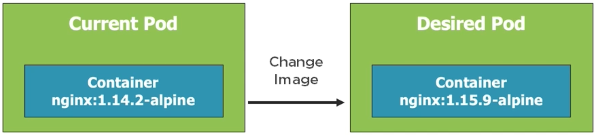
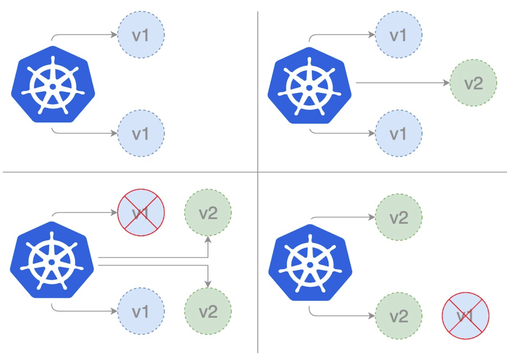

# Deployments

We need to understand about ReplicaSets before we talk about the Deployments. ReplicaSets are the fundamental K8s object, which maintains the creation and managing the Pods. A Deployment manages the Pods with the help of ReplicaSets. In the evolution story of K8s ReplicaSets came before Deployments. One of the basic promises of K8s is to preserve the desired cluster state. The applications are implemented and running inside the containers and they are hosted by the Pods. Hence, in some sense at any given point in time the running Pods and their number inside the cluster represent the cluster state. Deployment and ReplicaSets are the mechanism, with which this is state is maintained.

Deployments and ReplicaSets implement the self-healing mechanism of K8s. At any given point they maintain the desired number of running Pods. We'd see, that they also depend upon the Pod template. Following are some key points to keep in mind, before we start going into practical handling of Deployments.

- Deployments can scale Pods by adapting the ReplicaSets.
- Deployments and ReplicaSets support zero-downtime deployment of applications i.e., in order to rollout a new cluster state we don't need to take down the application.
- They also enable the quicker rollback utility.
- Previously, we used some `labels` for the Pods but did not make use of them anywhere. We'd shortly see, that the Deployments and ReplicaSets make use of them to manage Pods.

Following is an example YAML specification for a Deployment object.

```yaml
apiVersion: apps/v1 # Specify the API version, this time it is a bit different from Pod
kind: Deployment # Kind of the object is Deployment
metadata: # Place to put useful information about the Deployment like its name and any labels
  name: nginx-deployment # Name of the deployment
  labels: # Label specification for the Deployment. If we have multiple Deployments, we can select a particular one with Deployment. Later we'd see, where this is helpful
    app: my-nginx
    tier: frontend
spec: # Deployment specification
  selector: # Pod selector (encapsulates the mechanism to select Pods that it must manage)
    matchLabels: # We specify, that we want to select Pods, which match the specified labels
      app: nginx
  replicas: 2 # Tells deployment to run 2 pods matching the template (in our case template the is matchLabels defined under the selector)
  template: # Template used to create Pods
    metadata: # Place the useful information about the Pod like specify its labels, based on which it would be selected by the Deployment
      labels: # Labels specification
        app: nginx # Label based on which this Pod would be identified by the Deployment
    spec: # Pod specification
      containers: # Container specification
        - name: nginx # Container name
          image: nginx:1.14.2 # Base image for the container
          ports: # Port specification
            - containerPort: 80 # Container pot
```

The example above is one, in which we have included the Pod template inside the Deployment. That may not be the desirable way to go always. If we want, we could also define Pod templates in separate files and mention them under template. But this style of putting it together is also popular to have a full view of the desired cluster state. In a Deployment specification, following fields are expected.

- `apiVersion` - Which version of the K8s API to use.
- `kind` - What kind of object we want to create.
- `metadata` - Data that helps uniquely identify the object, including a name string, UID, and optional namespace.
- `spec` - What state we desire for the object and that refers to the first level spec, that we see in our example above.

Following are some of the commands, which we'd make use of in he following practice exercises.

```bash
$ k create -f deployment_spec.yaml --save-config
$ k apply -f deployment_spec.yaml
$ k get deployment --show-labels
$ k get deployment -l app=nginx # -l flag is used to filter deployments with label e.g., app:my-nginx
$ k delete deployment <deployment_name>
$ k delete deployment -f deployment_spec.yaml
$ k scale deployment [<deployment_name> | -f deployment_spec.yaml] --replicas=5 # We could also do this by simply updating the YAML specification and use the apply command
```

Now it is time to see some of these commands in action. We have created the following Deployment specification.

```yaml
apiVersion: apps/v1
kind: Deployment
metadata:
  name: my-nginx
  labels:
    app: my-nginx
spec:
  selector:
    matchLabels:
      app: my-nginx
  replicas: 2
  template:
    metadata:
      labels:
        app: my-nginx
    spec:
      containers:
        - name: my-nginx
          image: nginx:alpine
          resources:
            limits:
              memory: "128Mi"
              cpu: "200m"
          ports:
            - containerPort: 80
          livenessProbe:
            httpGet:
              path: /index.html
              port: 80
            initialDelaySeconds: 15
            timeoutSeconds: 2
            periodSeconds: 5
            failureThreshold: 1
          readinessProbe:
            httpGet:
              path: /index.html
              port: 80
            initialDelaySeconds: 3
            periodSeconds: 5
            failureThreshold: 1
```

and with this yaml specification we are going to create a deployment.

```bash
$ k create -f fundamentals/Deployment/nginx_deployment_spec.yaml --dry-run=client --validate=true

deployment.apps/my-nginx created (dry run)

$ k create -f fundamentals/Deployment/nginx_deployment_spec.yaml --save-config
deployment.apps/my-nginx created

$ k get all
NAME                            READY   STATUS    RESTARTS   AGE
pod/my-nginx-54cddf7468-9qv6b   1/1     Running   0          18s
pod/my-nginx-54cddf7468-jl5lt   1/1     Running   0          18s

NAME                 TYPE        CLUSTER-IP   EXTERNAL-IP   PORT(S)   AGE
service/kubernetes   ClusterIP   10.96.0.1    <none>        443/TCP   20d

NAME                       READY   UP-TO-DATE   AVAILABLE   AGE
deployment.apps/my-nginx   2/2     2            2           18s

NAME                                  DESIRED   CURRENT   READY   AGE
replicaset.apps/my-nginx-54cddf7468   2         2         2       18s

$ k get deploy # Using any of the deploy, deployment or deployments have the same effect
NAME       READY   UP-TO-DATE   AVAILABLE   AGE
my-nginx   2/2     2            2           105s

$ k get deploy --show-labels
NAME       READY   UP-TO-DATE   AVAILABLE   AGE     LABELS
my-nginx   2/2     2            2           6m36s   app=my-nginx

$ k describe deployment -l app=my-nginx # Here is an example where we are using the label selector instead of the name
Name:                   my-nginx
Namespace:              default
CreationTimestamp:      Tue, 03 May 2022 04:43:09 +0200
Labels:                 app=my-nginx
Annotations:            deployment.kubernetes.io/revision: 1
Selector:               app=my-nginx
Replicas:               2 desired | 2 updated | 2 total | 2 available | 0 unavailable
StrategyType:           RollingUpdate
MinReadySeconds:        0
RollingUpdateStrategy:  25% max unavailable, 25% max surge
Pod Template:
  Labels:  app=my-nginx
  Containers:
   my-nginx:
    Image:      nginx:alpine
    Port:       80/TCP
    Host Port:  0/TCP
    Limits:
      cpu:        200m
      memory:     128Mi
    Liveness:     http-get http://:80/index.html delay=15s timeout=2s period=5s #success=1 #failure=1
    Readiness:    http-get http://:80/index.html delay=3s timeout=1s period=5s #success=1 #failure=1
    Environment:  <none>
    Mounts:       <none>
  Volumes:        <none>
Conditions:
  Type           Status  Reason
  ----           ------  ------
  Available      True    MinimumReplicasAvailable
  Progressing    True    NewReplicaSetAvailable
OldReplicaSets:  <none>
NewReplicaSet:   my-nginx-54cddf7468 (2/2 replicas created)
Events: # As we see, in this case the nature of the events are a bit different from that of the Pods
  Type    Reason             Age    From                   Message
  ----    ------             ----   ----                   -------
  Normal  ScalingReplicaSet  3m19s  deployment-controller  Scaled up replica set my-nginx-54cddf7468 to 2

$ k get po # This shows the number of currently running Pods. We want to scale this to 3 from command line
NAME                        READY   STATUS    RESTARTS   AGE
my-nginx-54cddf7468-9qv6b   1/1     Running   0          9m11s
my-nginx-54cddf7468-jl5lt   1/1     Running   0          9m11s

$ k scale deploy/my-nginx --replicas=3
deployment.apps/my-nginx scaled
$ k get po
NAME                        READY   STATUS    RESTARTS   AGE
my-nginx-54cddf7468-9qv6b   1/1     Running   0          10m
my-nginx-54cddf7468-f8l6f   0/1     Running   0          4s # Some times it takes a bit of time
my-nginx-54cddf7468-jl5lt   1/1     Running   0          10m
$ k get po
NAME                        READY   STATUS    RESTARTS   AGE
my-nginx-54cddf7468-9qv6b   1/1     Running   0          11m
my-nginx-54cddf7468-f8l6f   1/1     Running   0          32s # <- Now the Pod is ready
my-nginx-54cddf7468-jl5lt   1/1     Running   0          11m

$ k apply -f fundamentals/Deployment/nginx_deployment_spec.yaml # Now we are going back to the cluster state described in the YAML
deployment.apps/my-nginx configured
$ k get po
NAME                        READY   STATUS    RESTARTS   AGE
my-nginx-54cddf7468-9qv6b   1/1     Running   0          12m
my-nginx-54cddf7468-jl5lt   1/1     Running   0          12m
```

## Deployment Options

K8s Deployment offers several utilities, which are beneficial to cloud based applications. In this note we are going to briefly understand one of them for now, which is zero-downtime deployment of applications.



In this example we want to upgrade previously shipped web server version to a new one. The question is, how we can do this kind of changes and others without affecting the currently running applications. There are multiple options available for this such as,

- `Rolling updates` - Most straight forward strategy, which we are going to delve into at this point in time.
- `Blue-green deployment` - Think about running more than one environment running at the same time. We can test the changes in a dedicated environment before rerouting our traffic to it from the previous environment.
- `Canary deployment` - Think about rolling the changes for a very small portion of the traffic to evaluate the impact of the change before rolling the same for rest.
- `Rollbacks` - Think about getting back to the previous state before the change, as the name suggests.

### Rolling Updates [docs](https://kubernetes.io/docs/tutorials/kubernetes-basics/update/update-intro/)



This graphic taken from [this blog post](https://auth0.com/blog/deployment-strategies-in-kubernetes/) illustrates the idea of rolling updates cleanly. From a given cluster state having Pods running one version of the app we start by introducing an additional Pod with new version keeping the Pods having the older version still online. When the new Pod is ready, we start killing one of he older Pods. Then we roll another new Pod having the newer version and when it is ready we kill another of the older Pods. This is the general idea of rolling updates. There could be several ways of achieving this depending on the complexity of the application. However, in this example we'd stick to a simple strategy.

For this example we have created a simple file structure like this using some example files from this [GitHub Repository](https://github.com/DanWahlin/DockerAndKubernetesCourseCode). As prerequisite to this experiment, we need to create three images with three versions of the node-app. In order to make that process simple we have a docker-compose YAML descriptor. Hence, we can simply use the command `docker-compose build`.

```text
├── Deployment
│   ├── NA
│   ├── node_app_dep1.yaml
│   ├── node_app_dep2.yaml
│   └── node_app_dep3.yaml
├── NA
├── Service
│   └── node_app_lb_service.yaml
└── code
    └── rolling_updates
        ├── docker-compose.yaml
        └── node-app
            ├── v1
            │   ├── Dockerfile
            │   └── server.js
            ├── v2
            │   ├── Dockerfile
            │   └── server.js
            └── v3
                ├── Dockerfile
                └── server.js
```

This time we have created a simple load balancer Service. We'd study the Services as a standalone topic soon. For the sake of the demonstration here we need to create a basic one. Because, all cloud based applications are behind some kind of load balancer service and it enables the transparency of the cloud applications from the perspective, that the users don't know, which server is actually handling the incoming request.

```bash
$ k get all

NAME                 TYPE        CLUSTER-IP   EXTERNAL-IP   PORT(S)   AGE
service/kubernetes   ClusterIP   10.96.0.1    <none>        443/TCP   20d

$ k create -f fundamentals/Service/node_app_lb_service.yaml --save-config # Creates the LoadBalancer Service
service/node-app created

$ k get all
NAME                 TYPE           CLUSTER-IP      EXTERNAL-IP   PORT(S)        AGE
service/kubernetes   ClusterIP      10.96.0.1       <none>        443/TCP        20d
service/node-app     LoadBalancer   10.99.151.218   localhost     80:31821/TCP   3m11s # <- LoadBalancer Service

$ k create -f fundamentals/Deployment/node_app_dep1.yaml --save-config
deployment.apps/node-app created

$ k get all
NAME                           READY   STATUS    RESTARTS   AGE
pod/node-app-7dd5f88f5-6mghd   1/1     Running   0          10s
pod/node-app-7dd5f88f5-96f98   1/1     Running   0          10s
pod/node-app-7dd5f88f5-gdd5p   1/1     Running   0          10s

NAME                 TYPE           CLUSTER-IP      EXTERNAL-IP   PORT(S)        AGE
service/kubernetes   ClusterIP      10.96.0.1       <none>        443/TCP        20d
service/node-app     LoadBalancer   10.99.151.218   localhost     80:31821/TCP   4m41s

NAME                       READY   UP-TO-DATE   AVAILABLE   AGE
deployment.apps/node-app   3/3     3            0           10s

NAME                                 DESIRED   CURRENT   READY   AGE
replicaset.apps/node-app-7dd5f88f5   3         3         3       10s

# At this point upon accessing localhost:80 from the host machine we can see something like this -> Node v1 running in a pod: node-app-7dd5f88f5-96f98
# Noticeable thing would be, that the container id 7dd5f88f5-96f98 won't change even after refreshing the page any number of time. It may seem, that the LoadBalancer is not working but in practice, browsers create a single connection to the server and when it has already established a connection, LoadBalancer is smart enough to ensure the consistency in the connection from the browser.
# Now we change the deployment to migrate to version 2 of the application.

$ k apply -f fundamentals/Deployment/node_app_dep2.yaml
deployment.apps/node-app configured

$ k get all

NAME                            READY   STATUS              RESTARTS   AGE
pod/node-app-79db4579fd-79lbd   0/1     ContainerCreating   0          1s
pod/node-app-79db4579fd-hp484   1/1     Running             0          2s
pod/node-app-79db4579fd-vmbm6   1/1     Running             0          3s
pod/node-app-7dd5f88f5-6mghd    1/1     Running             0          12m
pod/node-app-7dd5f88f5-96f98    1/1     Terminating         0          12m
pod/node-app-7dd5f88f5-gdd5p    1/1     Terminating         0          12m

NAME                 TYPE           CLUSTER-IP      EXTERNAL-IP   PORT(S)        AGE
service/kubernetes   ClusterIP      10.96.0.1       <none>        443/TCP        20d
service/node-app     LoadBalancer   10.99.151.218   localhost     80:31821/TCP   16m

NAME                       READY   UP-TO-DATE   AVAILABLE   AGE
deployment.apps/node-app   3/3     3            3           12m

NAME                                  DESIRED   CURRENT   READY   AGE
replicaset.apps/node-app-79db4579fd   3         3         2       3s
replicaset.apps/node-app-7dd5f88f5    1         1         1       12m

# Upon refreshing the localhost:80 browser page: Node v2 running in a pod: node-app-79db4579fd-hp484

$ k get po

NAME                        READY   STATUS        RESTARTS   AGE
node-app-79db4579fd-79lbd   1/1     Running       0          21s
node-app-79db4579fd-hp484   1/1     Running       0          22s
node-app-79db4579fd-vmbm6   1/1     Running       0          23s
node-app-7dd5f88f5-6mghd    1/1     Terminating   0          12m
node-app-7dd5f88f5-96f98    1/1     Terminating   0          12m
node-app-7dd5f88f5-gdd5p    1/1     Terminating   0          12m

# Upon refreshing the localhost:80 browser page: Node v2 running in a pod: node-app-79db4579fd-hp484

$ k get po

NAME                        READY   STATUS    RESTARTS   AGE
node-app-79db4579fd-79lbd   1/1     Running   0          38s
node-app-79db4579fd-hp484   1/1     Running   0          39s
node-app-79db4579fd-vmbm6   1/1     Running   0          40s

# Repeating the experiment once more with version 3

$ k apply -f fundamentals/Deployment/node_app_dep3.yaml
deployment.apps/node-app configured

$ k get po

NAME                        READY   STATUS        RESTARTS   AGE
node-app-5fd7b9788f-49gbj   1/1     Running       0          4s
node-app-5fd7b9788f-dpnfz   1/1     Running       0          5s
node-app-5fd7b9788f-rqsvm   1/1     Running       0          6s
node-app-79db4579fd-79lbd   1/1     Terminating   0          3m31s
node-app-79db4579fd-hp484   1/1     Terminating   0          3m32s
node-app-79db4579fd-vmbm6   1/1     Terminating   0          3m33s

# Upon refreshing the localhost:80 browser page: Node v3 running in a pod: node-app-5fd7b9788f-rqsvm

$ k get po

NAME                        READY   STATUS    RESTARTS   AGE
node-app-5fd7b9788f-49gbj   1/1     Running   0          40s
node-app-5fd7b9788f-dpnfz   1/1     Running   0          41s
node-app-5fd7b9788f-rqsvm   1/1     Running   0          42s

# Upon refreshing the localhost:80 browser page: Node v3 running in a pod: node-app-5fd7b9788f-rqsvm

# From the first time we have established the server connection on localhost:80 in this experiment and throughout the rolling updates we did not loose the server connection for a single time. This is the essence of zero-downtime deployment. With each upgrade of the version a server connection to the newer version of the app is established.

$ k delete -f fundamentals/Deployment/node_app_dep3.yaml
deployment.apps "node-app" deleted

$ k get all

NAME                            READY   STATUS        RESTARTS   AGE
pod/node-app-5fd7b9788f-49gbj   1/1     Terminating   0          6m20s
pod/node-app-5fd7b9788f-dpnfz   1/1     Terminating   0          6m21s
pod/node-app-5fd7b9788f-rqsvm   1/1     Terminating   0          6m22s

NAME                 TYPE           CLUSTER-IP      EXTERNAL-IP   PORT(S)        AGE
service/kubernetes   ClusterIP      10.96.0.1       <none>        443/TCP        20d
service/node-app     LoadBalancer   10.99.151.218   localhost     80:31821/TCP   26m

$ k delete -f fundamentals/Service/node_app_lb_service.yaml
service "node-app" deleted
```

This example was a gentle introduction to the Deployment options of K8s with a simple strategy to rolling updates. In practice Deployment options is a much bigger story, which will be unfolded gradually. In this example we also introduced a simple LoadBalancer Service to make sense of the demonstration. Next, we'd explore the Service as a standalone K8s object and the role it plays in a K8s cluster.
