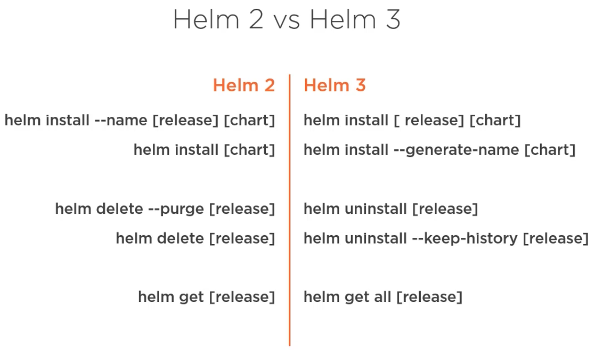
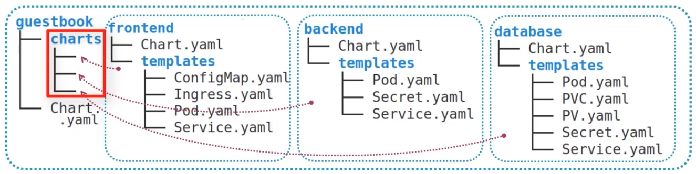
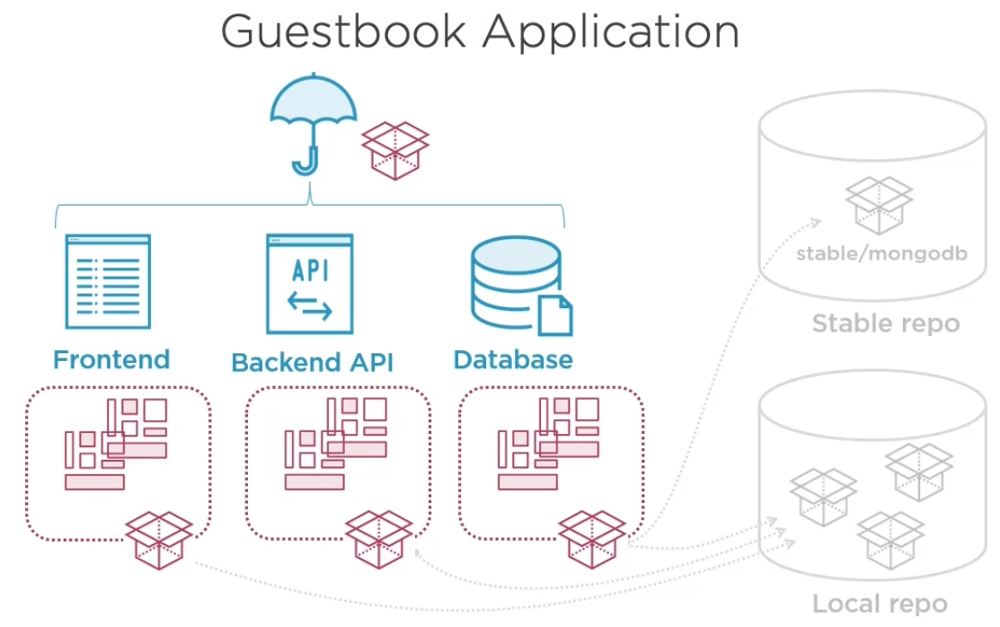

# [Helm](https://helm.sh)

Helm is the package manager for K8s. One of the main utilities of the helm is to group the YAML manifests for running
our apps on K8s together inside something called `Charts`. Below is the structure of a helm Chart.


- The parent directory name, in this case `chart_demo` is the default name of the chart.
- The `Chart.yaml` file includes chart name, version along with all other metadata.
- The `templates` directory contains raw YAML manifests for K8s objects. By raw YAML manifests we mean that we can use
variables/placeholders for various fields in these manifests.
- The values for the aforementioned variables would come from the `values.yaml` file, sometimes using additional helper
functions defined in `_helpers.tpl` in this example.


Above illustration shows a scenario when our chart may depend upon another chart e.g., mongodb. We include the same
chart as an archive inside the underlying `charts` directory. There are alternative options to incorporate dependencies
in our chart. Apart from the `chart`  directory we can also specify the dependency charts into `Charts.yaml` file or
`requirements.yaml` file. The later is there for helm version2 compatibility but it is no longer the preferred way to
incorporate dependencies.


- We can describe the chart in the `README.md` file.
- We can incorporate additional changes, version changes or other specifications about usage of the chart in the
`NOTES.txt` file.
- The `values.schema.json` file describes the structure of the values in the `values.yaml` file. We'd understand it
shortly.


Above is more or less a complete picture of a chart. In this apart from YAML manifests, dependencies and values as
described above we see two other components.

- The `tests` directory contains Pod definitions used for testing, which we'd learn later.
- The `crds` stands for Ks custom resource definitions.

These are mentioned separately from other chart specifications because these elements are incorporated before all other
K8s objects and they have some limitations.


Above illustration briefly shows the general structure of the Chart.yaml file. The `name` and `description` fields
are sel;f-explanatory. Apart from that following needs special care.

- The `apiVersion: v2` is a bit misleading because `v2` in this case denotes helm version 3, whereas v1 denotes helm
version 2.
- The `type` denotes that the helm chart encapsulates a K8s application. There are possibilities to incorporate
non-application functionalities inside helm charts. For those cases we use type as `library` but these use cases are
still very rare. In most cases the type denotes `application`.
- The `keywords` field is helpful to search for specific helm charts in a helm repository. We'd learn more about this
later.
- The `appVersion` denotes the version of the application to be installed using the helm chart.
- The `version` is the version of the helm chart itself.
- The `dependencies` generally lists other charts on which this chart depends upon.

The `appVersion` and `version` are semantically separate from each other. One does not necessarily need to change with
a change of another.

## Release Revision


A helm chart is the definition of K8s application whereas an installation of the chart is an instance of the same.
In the above illustration is denoted as Release. When we keep the chart unchanged but make some implementation changes
and want to deploy a new `appVersion` that is called a **revision** of the existing **release**. In this situation we
don't change the `version` in the `Chart.yaml`. In contrast, when the inner structure of the chart itself changes in
some way then depending on the situation we change `version` as well as the `appVersion` (if necessary). In that case
it could be either be a revision or an entirely new release. Normally we tend to make one release of a chart in one
cluster but there could be situations when that is not true. In the later case we need to be extremely careful about
ensuring that our releases don't conflict among each other.


Above illustration shows some of the main helm commands which we will practice with. These are also the mostly used
commands while working with helm. That being said there are some notable differences between the commands invocation
between helm version 2 and 3. Following is a small illustration.



However, since we are dealing with simplified helm version 3, we don't need to pay much attention to helm version 2
unless needed.

Our `guestbook_1` helm chart describes a basic helm package and we try to invoke it in the following manner.

```bash
# We invoke helm to install a release to our cluster by mentioning a name for the release and the subsequently the 
# helm chart for the same.
$ helm install demo-guestbook1 guestbook_1

NAME: demo-guestbook1
LAST DEPLOYED: Fri Jan 27 13:58:12 2023
NAMESPACE: default
STATUS: deployed
REVISION: 1
TEST SUITE: None

# And this deploys all our K8s object to the minikube cluster

$ k get all

NAME                           READY   STATUS    RESTARTS   AGE
pod/frontend-bbf49b859-rm5j7   1/1     Running   0          2m31s

NAME                 TYPE        CLUSTER-IP     EXTERNAL-IP   PORT(S)   AGE
service/frontend     ClusterIP   10.96.182.63   <none>        80/TCP    2m31s
service/kubernetes   ClusterIP   10.96.0.1      <none>        443/TCP   182d

NAME                       READY   UP-TO-DATE   AVAILABLE   AGE
deployment.apps/frontend   1/1     1            1           2m31s

NAME                                 DESIRED   CURRENT   READY   AGE
replicaset.apps/frontend-bbf49b859   1         1         1       2m31s

$ helm list --short
demo-guestbook1

# We can also see the K8s object manifest at a glance by in the following 
# manner. This will show all the usual K8s object manifest in a way, which is 
# familiar to us from the practices so far.
$ helm get manifest demo-guestbook1 | less
```

Now let's see how to update the revision for this application. In the same `guestbook_1` helm chart we are making the
following changes.

- In the Chart.yaml we update the `appVersion`, `description` by simply updating te version 1.0 to 1.1.
- We keep the `version` unchanged since in this mock example the helm chart itself is not changing.
- Finally, in the Deployment manifest `frontend.yaml` we change the image version under the container from 1.0 to 1.1.

And following is how we roll out the revision 1.1.

```bash
$ helm upgrade demo-guestbook1 guestbook_1

Release "demo-guestbook1" has been upgraded. Happy Helming!
NAME: demo-guestbook1
LAST DEPLOYED: Fri Jan 27 14:10:15 2023
NAMESPACE: default
STATUS: deployed
REVISION: 2
TEST SUITE: None

# Since this example is being executed currently from macOS we need to use the minikube tunnel option to look at the 
# effect of the upgrade in browser. Since we have used the version 1.1 image the app would reflect that version.
```

Now if we need to rollback the revision we just need the revision number, which is in this case 1 i.e., the first
revision.

```bash
$ helm rollback demo-guestbook1 1

Rollback was a success! Happy Helming!

# Pull the history for our releases
$ helm history demo-guestbook1

REVISION        UPDATED                         STATUS          CHART           APP VERSION     DESCRIPTION     
1               Fri Jan 27 13:58:12 2023        superseded      guestbook-0.1.0 1.0             Install complete
2               Fri Jan 27 14:10:15 2023        superseded      guestbook-0.1.0 1.1             Upgrade complete
3               Fri Jan 27 14:15:10 2023        deployed        guestbook-0.1.0 1.0             Rollback to 1  
```

Finally following is how we uninstall a release.

```bash
$ helm uninstall demo-guestbook1

release "demo-guestbook1" uninstalled

# This command will delete all K8s resources along with the configuration metadata which was being maintained inside
# K8s.
```

## Umbrella Chart

When the chart of an application encapsulates one or more other charts for the dependencies of the application or charts
for various components of the application the patent chart is called an umbrella chart. Following is an illustration of
how we can organize umbrella charts with its underlying components charts. This is the version 2.0 of the guestbook
application.



For this experiment we have created an umbrella chart in the `./fundamentals/Helm/guestbook_2` directory.

```bash
$ helm install demo-guestbook2 guestbook_2

NAME: demo-guestbook2
LAST DEPLOYED: Fri Jan 27 14:56:58 2023
NAMESPACE: default
STATUS: deployed
REVISION: 1
TEST SUITE: None
```

And this automatically installs all K8s objects and configurations with the release to make the application up and
running, which is accessible using the ingress proxy and again using `minikube tunnel` in case of macOS. All in all,
following is the general structure of the application that we deployed using the umbrella chart.


