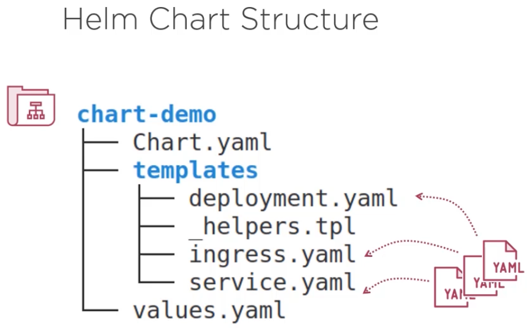
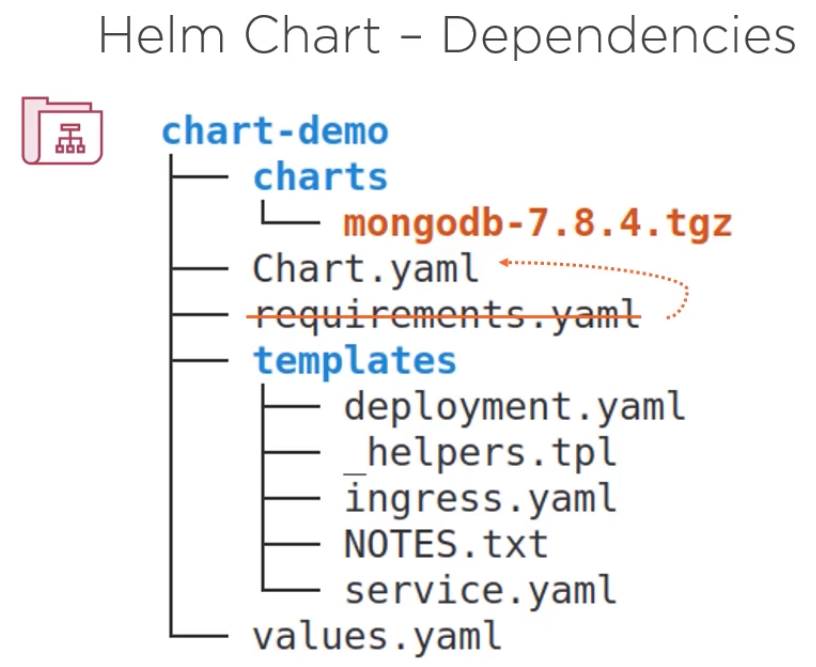
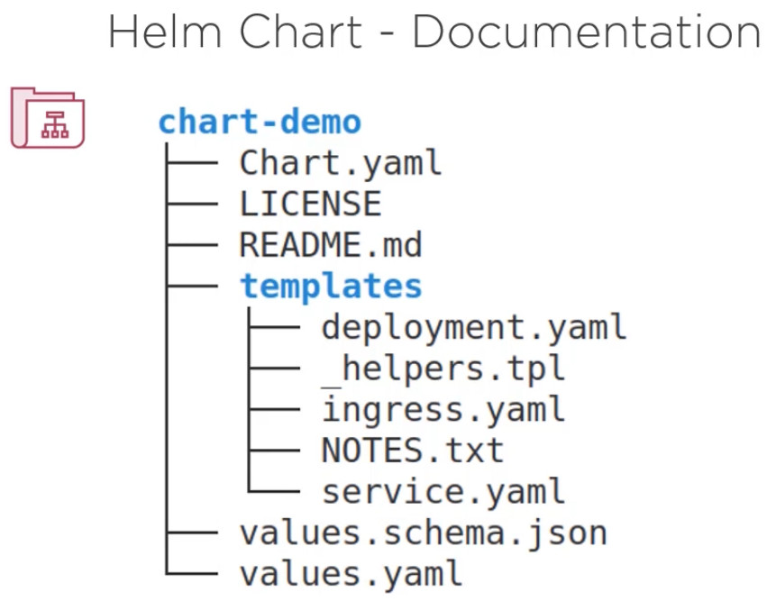
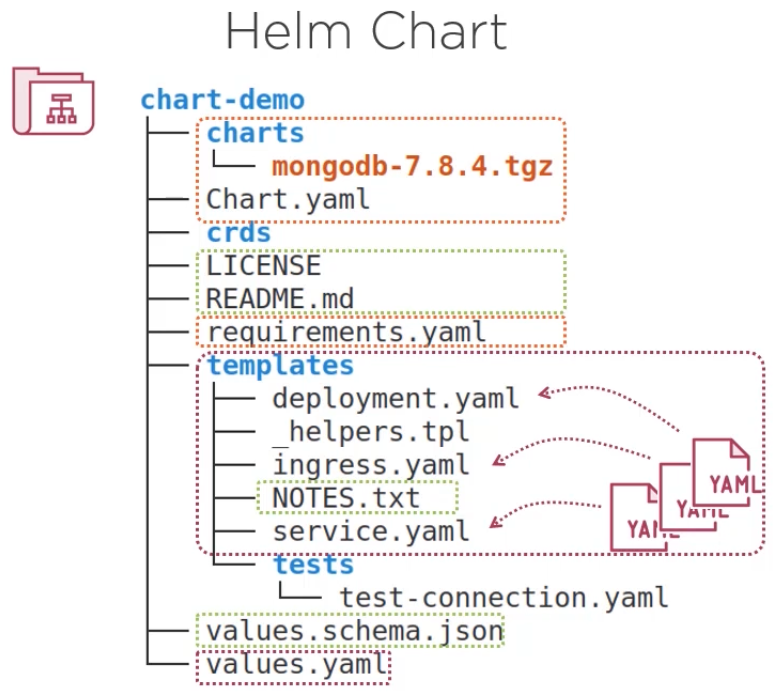
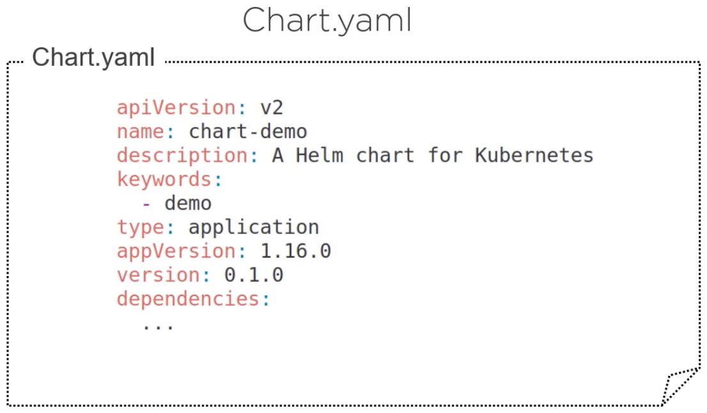
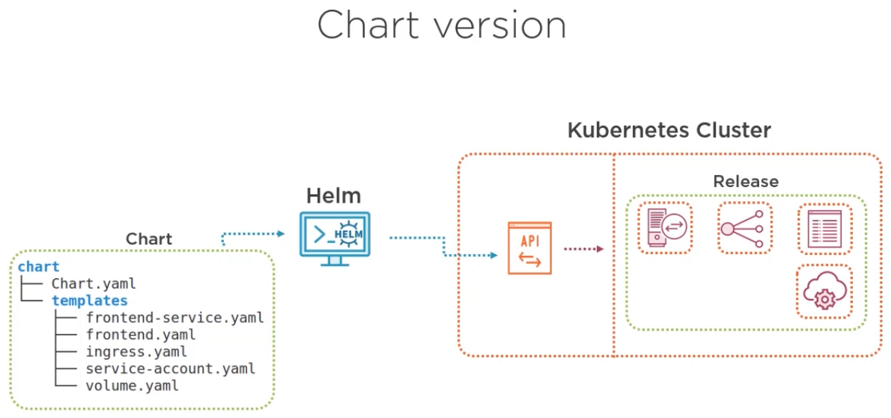
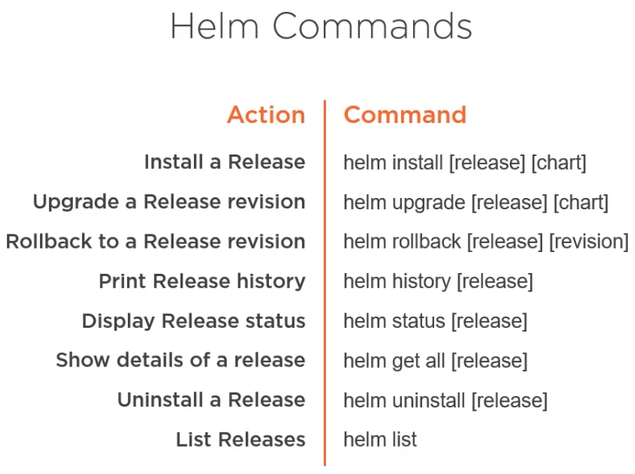

# [Helm](https://helm.sh)

Helm is the package manager for K8s. One of the main utilities of the helm is to group the YAML manifests for running
our apps on K8s together inside something called `Charts`. Below is the structure of a helm Chart.

- The parent directory name, in this case `chart_demo` is the default name of the chart.
- The `Chart.yaml` file includes chart name, version along with all other metadata.
- The `templates` directory contains raw YAML manifests for K8s objects. By raw YAML manifests we mean that we can use
variables/placeholders for various fields in these manifests.
- The values for the aforementioned variables would come from the `values.yaml` file, sometimes using additional helper
functions defined in `_helpers.tpl` in this example.

Above illustration shows a scenario when our chart may depend upon another chart e.g., mongodb. We include the same
chart as an archive inside the underlying `charts` directory. There are alternative options to incorporate dependencies
in our chart. Apart from the `chart`  directory we can also specify the dependency charts into `Charts.yaml` file or
`requirements.yaml` file. The later is there for helm version2 compatibility but it is no longer the preferred way to
incorporate dependencies.

- We can describe the chart in the `README.md` file.
- We can incorporate additional changes, version changes or other specifications about usage of the chart in the
`NOTES.txt` file.
- The `values.schema.json` file describes the structure of the values in the `values.yaml` file. We'd understand it
shortly.

Above is more or less a complete picture of a chart. In this apart from YAML manifests, dependencies and values as
described above we see two other components.

- The `tests` directory contains Pod definitions used for testing, which we'd learn later.
- The `crds` stands for Ks custom resource definitions.

These are mentioned separately from other chart specifications because these elements are incorporated before all other
K8s objects and they have some limitations.

Above illustration briefly shows the general structure of the Chart.yaml file. The `name` and `description` fields
are sel;f-explanatory. Apart from that following needs special care.

- The `apiVersion: v2` is a bit misleading because `v2` in this case denotes helm version 3, whereas v1 denotes helm
version 2.
- The `type` denotes that the helm chart encapsulates a K8s application. There are possibilities to incorporate
non-application functionalities inside helm charts. For those cases we use type as `library` but these use cases are
still very rare. In most cases the type denotes `application`.
- The `keywords` field is helpful to search for specific helm charts in a helm repository. We'd learn more about this
later.
- The `appVersion` denotes the version of the application to be installed using the helm chart.
- The `version` is the version of the helm chart itself.
- The `dependencies` generally lists other charts on which this chart depends upon.

The `appVersion` and `version` are semantically separate from each other. One does not necessarily need to change with
a change of another.

## Release Revision

A helm chart is the definition of K8s application whereas an installation of the chart is an instance of the same.
In the above illustration is denoted as Release. When we keep the chart unchanged but make some implementation changes
and want to deploy a new `appVersion` that is called a **revision** of the existing **release**. In this situation we
don't change the `version` in the `Chart.yaml`. In contrast, when the inner structure of the chart itself changes in
some way then depending on the situation we change `version` as well as the `appVersion` (if necessary). In that case
it could be either be a revision or an entirely new release. Normally we tend to make one release of a chart in one
cluster but there could be situations when that is not true. In the later case we need to be extremely careful about
ensuring that our releases don't conflict among each other.

Above illustration shows some of the main helm commands which we will practice with. These are also the mostly used
commands while working with helm.
