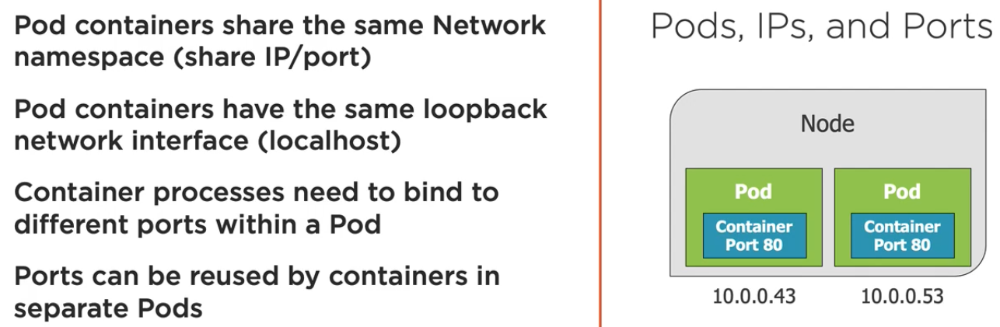
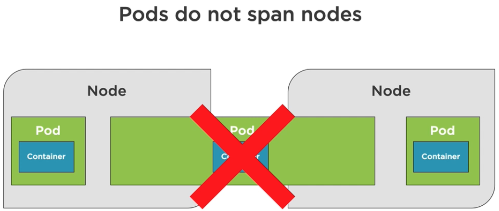

# [Pods](https://kubernetes.io/docs/concepts/workloads/pods/)

> A Pod is the basic execution unit of a K8s application, the smallest and simples unit in the K8s object model that we can create and deploy.

- Pods have a container runtime, where they can host one or more containers.
- Often we distribute application components e.g., servers, caching, APIs, database etc. into pods.
- A Pod has an IP address, memory, volume etc., which can be shared across multiple containers inside a Pod. A Pod can also run one single container in it.
- Using replicas we can scale out Pods horizontally.
- Pod can run healthy or crash and be removed by K8s. Same Pod can not come back to life. If a Pod crashes for some reason, K8s would attempt to spawn a new Pod according to replica set.
- Scheduler component of the master Node schedules Pods in worker Nodes.

Following illustration demonstrates some key networking oriented constrains for the Pods.



- Each Pod within a Node would have a unique IP address (also called cluster IP addresses).
- If a Pod hosts multiple Containers, each Container within the Pod would have a unique port number but they share the same IP address of the Pod. They would also share the `localhost` loopback network interface within the Pod. In the illustration above we see a more general use case, where a single Pod hosts a single Container and in that case those Containers can have same port numbers because they are separated their individual Pod namespaces.



Above is an impossible scenario in K8s. Separate Nodes can not share a Pod because of the IP addresses and name resolution issues.

## Run Pods

There are two different ways in K8s to run Pods or any other similar resource for that matter. They are referred to as `imperative` and `declarative`. We first look at the imperative way, where we can simply use the `kubectl run` command providing an image name and various other flags to quickly run a Pod. We'd eventually understand, that this is the least used way to interact with the K8s.

### Imperative

```bash
# This would run a single Pod hosting an nginx:alpine based container inside it.
$ k run hellopod --image=nginx:alpine

# Outcome
$ k get all

NAME           READY   STATUS    RESTARTS   AGE
pod/hellopod   1/1     Running   0          18s

NAME                 TYPE        CLUSTER-IP   EXTERNAL-IP   PORT(S)   AGE
service/kubernetes   ClusterIP   10.96.0.1    <none>        443/TCP   18d

$ k get pods

NAME       READY   STATUS    RESTARTS   AGE
hellopod   1/1     Running   0          78s

# Per default the IP address of the Pod would be accessible from the inside of the cluster only.
# Port forwarding from the nginx server (80) running inside the Pod to host machine (8888)
$ k port-forward hellopod 8888:80

Forwarding from 127.0.0.1:8888 -> 80
Forwarding from [::1]:8888 -> 80
Handling connection for 8888  # This way we can interact with the nginx server running inside the Pod from host machine

# Delete a Pod
$ k delete pod/hellopod

pod "hellopod" deleted
```

### Declarative

Following is an example of yaml declaration, which shows some key properties of YAML.

```yaml
key: value # Simple key value example
complexMap: # Nested key value example
  key1: value
  key2:
    subKey: value
items: # Simple list of values example
  - item1
  - item2
itemsMap: # List can define sequence maps
  - map1: value
    map1Prop: value
  - map2: value
    map2Prop: value
```

[Pod](https://kubernetes.io/docs/concepts/workloads/pods/) is documented in the K8s website. Following is a simple example of, how the declarative Pod specification looks like. We can take this specification and create a Pod in K8s.

```yaml
apiVersion: v1 # K8s API version
kind: Pod # Object type is a Pod
metadata:
  name: hello-nginx # Desired name of the object
  labels: #  Labels acts as identifiers for Pods, we can filter Pods using these labels among others
    app: nginx
    rel: stable
spec: # Specification of the Pod
  containers: # Specification of the hosted Container
    - name: hello-nginx # Container name
      image: nginx:1.14.2 # Image from which the Container would be built
      ports: # Container port specification
        - containerPort: 80
```

```bash
# Using ./fundamentals/Pods/nginx_pod_spec.yaml
# Here we are making a dry run and not exactly creating Pod, rather validating the YAML and doing a dry run
$ k create -f fundamentals/Pod/nginx_pod_spec.yaml --dry-run=client --validate=true

pod/hello-nginx created (dry run)

# Create an actual from the specification
# The --save-config flag saves the last applied pod specifications as n annotation in side he Pod specification
# metadata. We'd see that with our next command
$ k create -f fundamentals/Pod/nginx_pod_spec.yaml --save-config
pod/hello-nginx created

# The output of the following command is big because K8s adds a lot of metadata to the config but we just
# show the annotation part to highlight the effect of the --save-config flag, which we used during the Pod
# creation.
$ k get pod/hello-nginx -o yaml

...
annotations:
    kubectl.kubernetes.io/last-applied-configuration: |
      {"apiVersion":"v1","kind":"Pod","metadata":{"annotations":{},"labels":{"app":"nginx","rel":"stable"},"name":"hello-nginx","namespace":"default"},"spec":{"containers":[{"image":"nginx:1.14.2","name":"hello-nginx","ports":[{"containerPort":80}]}]}}
...

# Look inside the Pod in greater detail. This command would also create a huge outcome on the stdout.
# Hence, we are partially showing the outcome, especially the part called Events. These are the activities,
# which were performed during the Pod creation and are often helpful in troubleshooting if some error occurs.
# We also take notice, that which process creates and event e.g., some events are internal to the Pod, which
# are therefore coming from kubelet. The one coming from default-scheduler is the one from master node, which
# schedules and assigns the Pod to a Node (default worker Node in this case).
$ k describe pod/hello-nginx

Name:         hello-nginx
Namespace:    default
Priority:     0
Node:         docker-desktop/192.168.65.4
Start Time:   Sat, 30 Apr 2022 14:51:26 +0200
Labels:       app=nginx
              rel=stable
...
...
Events:
  Type    Reason     Age    From               Message
  ----    ------     ----   ----               -------
  Normal  Scheduled  6m47s  default-scheduler  Successfully assigned default/hello-nginx to docker-desktop
  Normal  Pulling    6m47s  kubelet            Pulling image "nginx:1.14.2"
  Normal  Pulled     6m36s  kubelet            Successfully pulled image "nginx:1.14.2" in 10.411351796s
  Normal  Created    6m36s  kubelet            Created container hello-nginx
  Normal  Started    6m36s  kubelet            Started container hello-nginx

# Alternative and mostly used command to create Pods from specification file because apply command creates
# a Pod if not exists already. If exists, it modifies the Pod state if applicable.
# In this case we have provided the same specification without change, hence we expect the unchanged message.
$ k apply -f fundamentals/Pod/nginx_pod_spec.yaml

pod/hello-nginx unchanged

# Like Docker exec we have a command to get a shell open inside the Container hosted by the Pod.
# We take a note of slight difference in the command format -- sh.
$ k exec hello-nginx -it -- sh

# ls -l
total 64
drwxr-xr-x   1 root root 4096 Mar 27  2019 bin
drwxr-xr-x   2 root root 4096 Feb  3  2019 boot
drwxr-xr-x   5 root root  360 Apr 30 12:51 dev
...

# We have an option to make live changes in the Pod. This opens the default text editor of the shell
# and provides a session. If we make some changes, that reflect to the Pod state. In this example we
# have not made any changes.
$ k edit pod  hello-nginx

Edit cancelled, no changes made.

# This is an alternative way to delete a Pod. The k delete pod/<pod_name> would also work. But sometimes
# in complex clusters, this is convenient.
$ k delete -f fundamentals/Pod/nginx_pod_spec.yaml

pod "hello-nginx" deleted
```

## Pod Health

We need to know about something called a [Probe](https://kubernetes.io/docs/concepts/workloads/pods/pod-lifecycle/#container-probes) to understand the Pod health. As per the standard documentation Probe is a diagnostic performed periodically by kubelet on the hosted Container(s). Prod has two categories.

- `Liveness`: It can be used to determine if a Pod is healthy and running.
- `Readiness`: It can be used to determine if a Pod can start receiving requests.

When a hosted Container in a Pod dies K8s tries to restart the Pod using a setting called `restartPolicy`, which has a default value of **always**. Probe can be used in few different ways to check the health of a Container. We can therefore configure the Probes with our own strategy.

- `exec`: Executes an action inside Container and validates based on the return code from the action.
- `tcpSocket`: Performs a TCP Socket connection establishment attempt on a specified port and the Probe successful if the port is open.
- `httpGet`: Performs an HTTP GET request against the Pod IP address with a port and a predefined path and validates if the return code is 200 or anything less than 400.
- `gRPC`: Performs a remote procedure call using [gRPC](https://grpc.io/), in which case target gRPC health check should be implemented inside Container.

[Here in the documentation](https://kubernetes.io/docs/tasks/configure-pod-container/configure-liveness-readiness-startup-probes/) more information is available to configure Probes. Following is basic example of configuring a liveness Probe.

```yaml
apiVersion: v1
kind: Pod
--- # Skipping other details
spec:
  containers:
    - name: hello-nginx
      image: nginx:alpine
      livenessProbe: # Liveness Probe definition to perform an HTTP GET
        httpGet:
          path: /index.html # This configuration needs us to create this file
          port: 80 # Request should go at port 80
        initialDelaySeconds: 15 # Wait 15 seconds before sending the first request
        timeoutSeconds: 2 # Timeout after 2 seconds
        periodSeconds: 5 # Check with liveNessProbe every 15 seconds
        failureThreshold: 1 # Allow 1 failed check before failing the Pod
```

Following is slightly different example to test liveness with `exec` option from the official documentation.

```yaml
apiVersion: v1
kind: Pod
metadata:
  labels:
    test: liveness
  name: liveness-exec
spec:
  containers:
    - name: liveness
      image: k8s.gcr.io/busybox
      args:
        - /bin/sh
        - -c
        - touch /tmp/healthy; sleep 30; rm -rf /tmp/healthy; sleep 600
      livenessProbe:
        exec: # Here we are configuring a command execution Probe.
          command:
            - cat
            - /tmp/healthy
        initialDelaySeconds: 5
        periodSeconds: 5
```

Following is an example of a readiness Probe with a very similar HTTP GET strategy. It makes sense to configure it in this way, because when we get a successful HTTP GET request from the web server at that point we can assume, that the Container is ready to accept further requests.

```yaml
apiVersion: v1
kind: Pod
--- # Skipping other details
spec:
  containers:
    - name: hello-nginx
      image: nginx:alpine
      readinessProbe: # Readiness Probe definition to perform an HTTP GET
        httpGet:
          path: /index.html # This configuration needs us to create this file
          port: 80 # Request should go at port 80
        initialDelaySeconds: 15 # Wait 15 seconds before sending the first request
        periodSeconds: 5 # Check with liveNessProbe every 15 seconds
```

As a practice example we have now created a Pods with following spec.

```yaml
apiVersion: v1
kind: Pod
metadata:
  name: hello-nginx
  labels:
    app: nginx
    rel: stable
spec:
  containers:
    - name: hello-nginx
      image: nginx:1.14.2
      ports:
        - containerPort: 80
      livenessProbe:
        httpGet:
          path: /index.html
          port: 80
        initialDelaySeconds: 15
        timeoutSeconds: 2
        periodSeconds: 5
        failureThreshold: 1
      readinessProbe:
        httpGet:
          path: /index.html
          port: 80
        initialDelaySeconds: 3
        periodSeconds: 5
        failureThreshold: 1

$ k apply -f fundamentals/Pod/nginx_pod_health.yaml # That creates the Pod

$ k describe pod hello-nginx # We focus on the Events part

Events:
  Type    Reason     Age   From               Message
  ----    ------     ----  ----               -------
  Normal  Scheduled  76s   default-scheduler  Successfully assigned default/hello-nginx to docker-desktop
  Normal  Pulled     76s   kubelet            Container image "nginx:1.14.2" already present on machine
  Normal  Created    76s   kubelet            Created container hello-nginx
  Normal  Started    76s   kubelet            Started container hello-nginx

# Everything looks normal because inside the /user/share/nginx/html path in the Container,
# which is the home path for nginx, here really exists an index.html file. We are going
# to mess with that file a bit.

$ k exec hello-nginx -it -- sh

> cd /usr/share/nginx/html
> pwd
/usr/share/nginx/html
> ls -l
total 8
-rw-r--r-- 1 root root 537 Dec  4  2018 50x.html
-rw-r--r-- 1 root root 612 Dec  4  2018 index.html
> rm -rf index.html
# ecommand terminated with exit code 137

$ k describe pod hello-nginx  # Upon doing k get pod we still got the Pod as running after exiting with an error earlier.

Events:
  Type     Reason     Age                  From               Message
  ----     ------     ----                 ----               -------
  Normal   Scheduled  8m13s                default-scheduler  Successfully assigned default/hello-nginx to docker-desktop
  Normal   Pulled     44s (x2 over 8m13s)  kubelet            Container image "nginx:1.14.2" already present on machine
  Normal   Created    44s (x2 over 8m13s)  kubelet            Created container hello-nginx
  Normal   Started    44s (x2 over 8m13s)  kubelet            Started container hello-nginx
  Warning  Unhealthy  44s (x2 over 44s)    kubelet            Readiness probe failed: HTTP probe failed with statuscode: 404
  Warning  Unhealthy  44s                  kubelet            Liveness probe failed: HTTP probe failed with statuscode: 404
  Normal   Killing    44s                  kubelet            Container hello-nginx failed liveness probe, will be restarted

# We see, that the even shows liveness and readiness Probe failures. We again inspect the running Container.

$ k exec hello-nginx -it -- sh

> cd /usr/share/nginx/html
> ls -l

total 8
-rw-r--r-- 1 root root 537 Dec  4  2018 50x.html
-rw-r--r-- 1 root root 612 Dec  4  2018 index.html

# We see, that the Container is restarted from the scratch and a new index.html file is created
```

And now we also try the liveness-exec example from the official documentation.

```yaml
$ k apply -f fundamentals/Pod/busybox-liveness.yaml

pod/liveness-exec created

$ k describe pod liveness-exec

Events: Type    Reason     Age   From               Message
  ----    ------     ----  ----               -------
  Normal  Scheduled  18s   default-scheduler  Successfully assigned default/liveness-exec to docker-desktop
  Normal  Pulling    18s   kubelet            Pulling image "k8s.gcr.io/busybox"
  Normal  Pulled     16s   kubelet            Successfully pulled image "k8s.gcr.io/busybox" in 1.536809626s
  Normal  Created    16s   kubelet            Created container liveness
  Normal  Started    16s   kubelet            Started container liveness

# Everything looks normal. Now we wait few seconds nd then again try to see the events.

$ k describe pod liveness-exec

Events:
  Type     Reason     Age                From               Message
  ----     ------     ----               ----               -------
  Normal   Scheduled  74s                default-scheduler  Successfully assigned default/liveness-exec to docker-desktop
  Normal   Pulling    75s                kubelet            Pulling image "k8s.gcr.io/busybox"
  Normal   Pulled     73s                kubelet            Successfully pulled image "k8s.gcr.io/busybox" in 1.536809626s
  Normal   Created    73s                kubelet            Created container liveness
  Normal   Started    73s                kubelet            Started container liveness
  Warning  Unhealthy  30s (x3 over 40s)  kubelet            Liveness probe failed: cat: can't open '/tmp/healthy': No such file or directory
  Normal   Killing    30s                kubelet            Container liveness failed liveness probe, will be restarted

# And we see now the liveness Probe in action exactly as defined.

$ k delete -f fundamentals/Pod/busybox-liveness.yaml

$ k get all

NAME                 TYPE        CLUSTER-IP   EXTERNAL-IP   PORT(S)   AGE
service/kubernetes   ClusterIP   10.96.0.1    <none>        443/TCP   18d
```

We'd wrap the introduction of the Pod as an individual K8s object here. There are many other things about Pods and its specifications but those we'd start exploring going forward starting from the Deployments. In real-world scenarios we hardly configure individual Pods, like we did in these examples. We do these things using Deployments and that's where we are going to focus.
