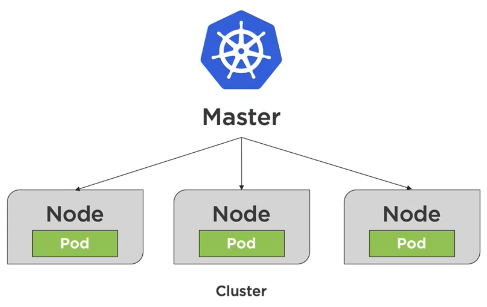
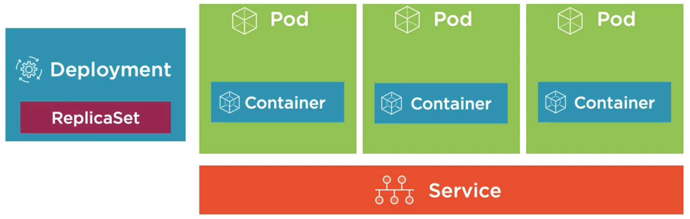
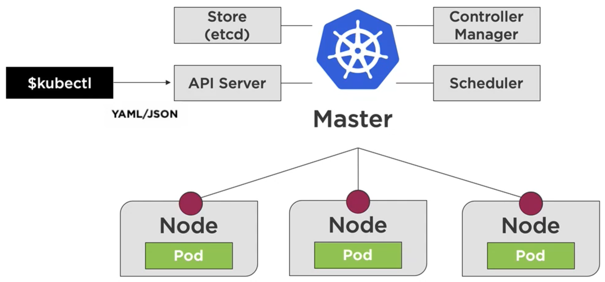
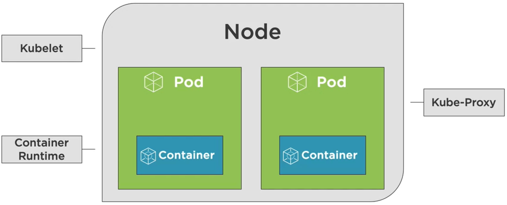
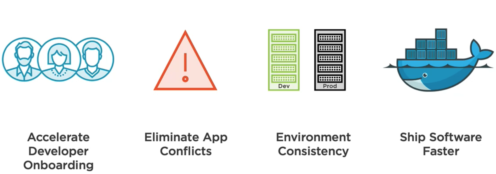
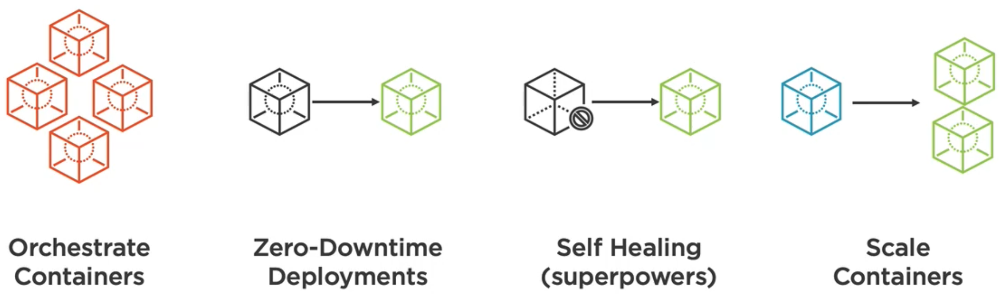
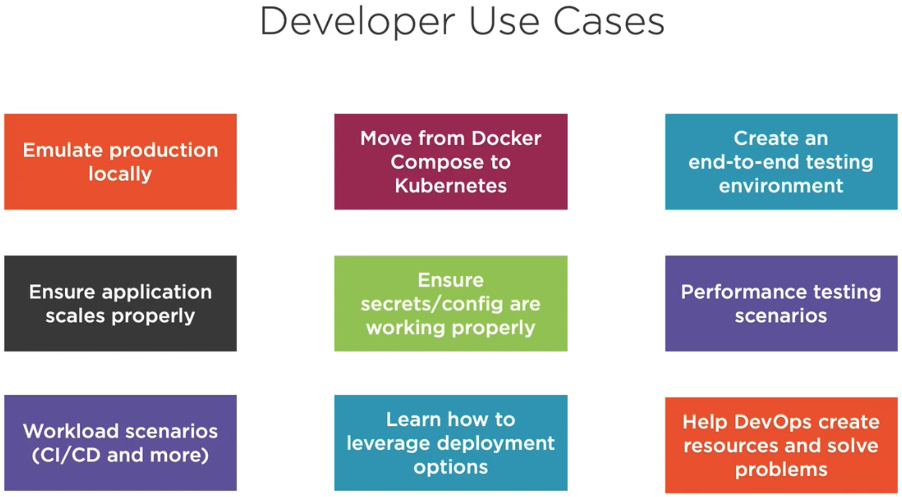
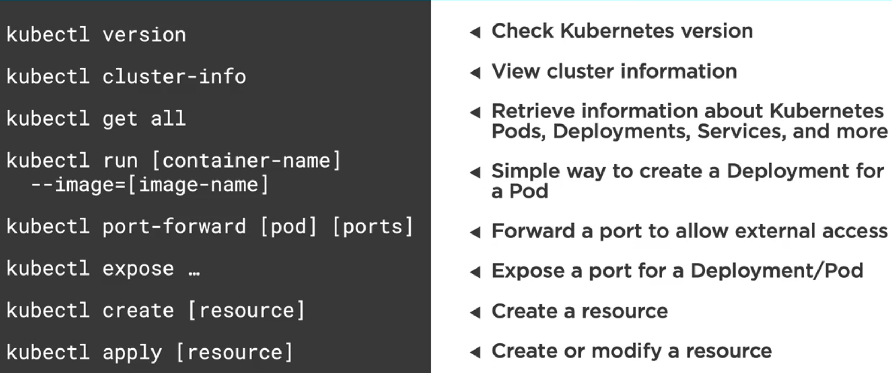

# K8s

This repository is created in order to consolidate the learning materials and practice exercises regarding the
preparation for the [CKAD](https://www.cncf.io/certification/ckad/) certification. Several resources in this repository
are taken from the following courses,

- Kubernetes for Developers: Core Concepts by Dan Wahlin @PluralSight

> [Kubernetes](https://kubernetes.io) is an open-source system of automating deployment, scaling and management of
containerized applications.

## Six Key Features Among Others

- `Service Discovery / Load Balancing` - Pertaining to a highly available cloud based application.
- `Storage Orchestration` - Think of how we use volumes in Docker compose.
- `Automate Rollout/Rollbacks` - Think of attributes like zero down time delivery.
- `Self-healing` - Think of the aspect of attempting revival of a container upon crashing.
- `Secret and Configuration Management` - Manage the keys, passwords and other settings for the cluster.
- `Horizontal Scaling` - Think of the aspect, when one or more containers are overloaded and more compute resource
available, the ability of automatically creating more containers and share the load.

> K8s provides a declarative way to define cluster state

This means suppose our application is running one container right now and we want to move to state of two containers
application. We could just submit this requirement using YAML or JSON and K8s can navigate the cluster to the desired
state.



K8s features a master node, which administers some worker nodes. Each node can be a virtual machine (most often) or a
physical machine. Each node runs one or more pods inside it. Each pod hosts containers.



Inside a node pods can not be orchestrated on their own, rather they are administered by something called a deployment.
Furthermore, these pods should be able to talk to the outside world and among themselves and something should also
monitor if the pods are healthy. Services are responsible for that.



While understanding the bigger picture of node orchestration we skipped some granular detail and now is the time to to
incorporate them. The master node has some components to carry out its business.

- `Store` ([etcd](https://etcd.io)) - Master node maintains a database (`etcd` - an open-source distributed key-value
store) store its metadata, configuration, internal state not only about itself but also about the nodes in the cluster
that it needs to administer. K8s being a distributed system needs distributed solution to read/write values and this is
true for all the nodes in the cluster.
- `Controller Manager` - It is a daemon process, that embeds the core control loops shipped with K8s. In applications
of robotics and automation, a control loop is a non-terminating loop, that regulates the state of the system.
- `Scheduler` - It is a control plane process which assigns Pods to Nodes. The scheduler determines which Nodes are
valid placements for each Pod in the scheduling queue according to constraints and available resources. The scheduler
then ranks each valid Node and binds the Pod to a suitable Node.
- `API Server` - It validates and configures data for the api objects which include pods, services, replication
controllers, and others. The API Server services REST operations and provides the frontend to the cluster's shared
state through which all other components interact. We interact with the API server using `$kubectl` command and often
passing YAML/JSON declarations along with the request to manage the cluster state.

Apart from the special capabilities of the master node each single node in general have some specific components with
definite purposes.



- `kubelet` - It is the primary "node agent" or in simpler terms an engine, that runs on each node. It can register the
node with the aforementioned API Server using one of: the hostname; a flag to override the hostname; or specific logic
for a cloud provider. The kubelet works in terms of a `PodSpec`, which we'd learn shortly.
- `Container Runtime` - A container runtime, also known as container engine, is a software component, that can run
containers on a host operating system. In this context the host operating system refers to that of a Node and as we
mentioned a Node is most often a virtual machine.
- `Kube-Proxy` - It is a network proxy that runs on each node in your cluster, implementing part of the Kubernetes
Service concept. kube-proxy maintains network rules on nodes, which includes allocating an IP address to the Node.
These network rules allow network communication to your Pods from network sessions inside or outside of your cluster.

## Why

### Why Containers



- `Accelerate Developer Onboarding` - Think about the ability to run a isolated self-contained development environment
using utilities like Docker Compose.
- `Eliminate App Version Conflicts` - Think about the ability to run different versions of an application simultaneously
in separate self-contained environments.
- `Environment Consistency` - Think about the ability of replicating a dev environment exactly as is for deployment to
production or test in terms of Containers. Since Containers are isolated environments we can replicate their
specifications in a declarative manner across environments.
- `Faster Delivery` - All of the above aspects enables a faster software delivery.

### Why K8s



Having the Container benefits understood, now we need to try to look at the bigger picture. A modern complex application
is inherently distributed in several components, each of which is having its own set of dependencies, meaning separate
containers. Hence, a complex application can be an orchestration of a number of containers. Docker compose provided
something like that. However, when we think about large scale applications, where we have to think about the
reliability, availability we need to think about the load balanced cluster environments. And there K8s comes in.



The image above helps is understand some very frequent situations, that we as developers face on our day to day work.
Running a small scale k8s environment locally may help us developing and testing our software.

## Getting Started

Following are some K8s command, which are often used. However, there are various other ways to interact with the K8s
API Server. These are just ones, that often come handy for quick actions.



We can add `alias k="kubectl"` in our shell configuration to make a shortcut to typing the command `$kubectl`.

### K8s Dashboard

K8s dashboard is an optional service, which lets us visualize the cluster state on browser. This is not mandatory,
however this is a good chance to try some K8s commands. Following are the commands, which we would be needing to enable
the dashboard. Some of these commands would be referred from the
[official guideline](https://kubernetes.io/docs/tasks/access-application-cluster/web-ui-dashboard/)

```bash
$ kubectl apply -f [dashboard-yaml-url from the official guideline]
$ kubectl describe secret -n kube-system -> This will list down all secrets and we need to locate the very first
secret:kubernetes.io/service-account-token and copy its token
$ kubectl proxy > This will run the dashboard server. The URL to access he dashboard is also documented in the official
guideline. There we'd have to login using the previously copies token.
```

Now, that we are somewhat familiar with the basic ideas of K8s, we would like to know more about the fundamental
objects of K8s. Following should be our references for this.

- [Pods](https://github.com/sarkarchandan/ckad-prep/blob/master/Pods.md)
- [Deployments](https://github.com/sarkarchandan/ckad-prep/blob/master/Deployments.md)
- [Services](https://github.com/sarkarchandan/ckad-prep/blob/master/Services.md)
- [Storage Options](https://github.com/sarkarchandan/ckad-prep/blob/master/Storage.md)
- [ConfigMaps and Secrets](https://github.com/sarkarchandan/ckad-prep/blob/master/ConfigMapsSecrets.md)

### Useful Commands

- View logs for a Pod's container - `kubectl logs [pod-name]`
- View the logs of a specific container within Pod - `kubectl logs [pod-name] -c [container-name`
- View the logs for previously running Pods - `kubectl logs -p [pod-name]`
- Stream a Pod's logs - `kubectl logs -f [pod-name]`
- Describe Pod details - `kubectl describe pod [pod-name]`
- Get Pod details with formatting - `kubectl get pod [pod-name] -o [yaml|json]` (Same works for any K8s resource)
- Run interactive shell within Pod - `kubectl exec -it [pod-name] sh`

### [Package Management with Helm](https://github.com/sarkarchandan/ckad-prep/blob/master/Helm.md)
