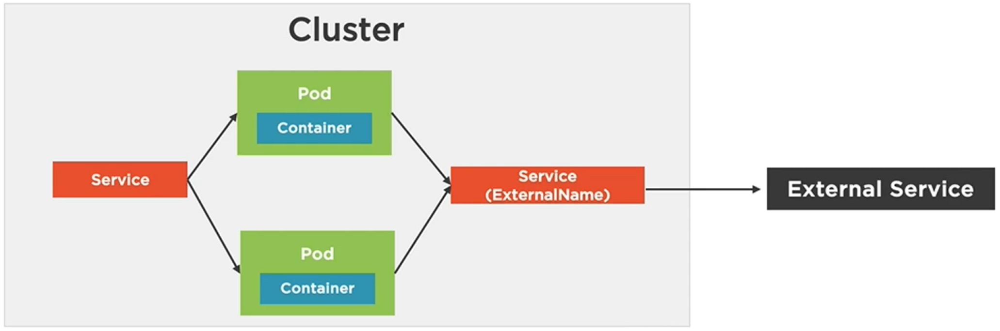

# Services

Services are defined by K8s as an abstract way to expose an application running on a set of Pods as network service. K8s gives Pods their own IP addresses and a single DNS name for a set of Pods and can load balance among them. Needless to say Pods can live or die, means their lifetime can be limited. Hence, trying to reach the application with Pod IP address directly is not a good idea. And their the abstract the unified interface of the K8s Services come in.

We have already discussed the idea of `labels` in our practice examples. Labels are glue, with which a Service can be associated with a set of Pods. The `kube-proxy` of Nodes create virtual IP addresses for Services. Services are not ephemeral / temporary like Pods. Services stick around provides an entry point to the application.


Services create something called endpoint in order to connect with Pods. Following image can intuitively illustrate, what they are. We see in this image, that external callers connects the Service via a externally known endpoint of a Service. Let's say this service encapsulates the Pods, which provides the frontend implementation for some applications and they identify each other using a label e.g., `frontend`. It might be the case, that internally these Pods are then talking to another Service, which creates an internal endpoint for backend service. This internal service and its underlying Pods can then identify themselves with the label e.g., `backend`.


[Services](https://kubernetes.io/docs/concepts/services-networking/service/) are one of the most if not the most central idea in K8s. In this note for now we'd stick to the very fundamentals of the Service but there are a lot more to the service, that we eventually need ot understand to be fluent with K8s. There are four main types of Services in K8s.

- `ClusterIP` - Default Service, which exposes the service on a cluster's internal IP. In simple terms we can only access this service from the inside of the cluster. When we run K8s and do a first time `kubectl get all` we see the default ClusterIP service running.

- `NodePort` - Expose a service on the external IP address of a given Node along with a static port on that Node. In the default case NodePort service automatically routes to ClusterIP service.

- `LoadBalancer` - Provision an external IP to act as a load balancer for the service. We have already seen a simpler version of this service in action earlier.

- `ExternalName` - Maps a service to a DNS name or an IP address.

We'd now look at each of the aforementioned category of services in some detail.

## ClusterIP

```bash
$ k get all --show-labels

NAME                 TYPE        CLUSTER-IP   EXTERNAL-IP   PORT(S)   AGE   LABELS
service/kubernetes   ClusterIP   10.96.0.1    <none>        443/TCP   21d   component=apiserver,provider=kubernetes
```

This is the ClusterIP service. This service is exposed internally within the cluster, means the IP above 10.96.0.1 is only accessible from the inside of the cluster. It means, unless we setup port-forwarding we can not access the cluster and its internal resources with that IP even from the host machine, where K8s is installed although the cluster and the Node is setup in the same machine.


Only the Pods within the cluster can talk to this service and also among each other using this Service if they need to.

## NodePort


NodePort Service exposes the application service on the external IP address of the Node. In order to do that K8s automatically allocates a static port from the range 30000 - 32767 but it is possible to override this setting. NodePort service creates a way to talk to the Pods running inside a given Node. So in this example an external user can communicate to one of the Pods running inside the specific Node on its external IP address and port 30100. This Service type is often useful for debugging purpose.

## Load Balancer

Load Balancers are important not only to prevent a Node or a Pod to be overburdened with massive amount of incoming traffics but also it is useful for large web-based applications to route the traffic to the Nodes located in different geographic regions. For cloud based applications K8s Load Balancer Service is often useful, when used in combination with the cloud provider's load balancer service. K8s itself has several options, when it comes to implementing a load balancing.


In this example we are seeing, two Nodes. We may have NodePort Service setup in these Nodes. Nodes also naturally have their ClusterIP Services running. The external Load Balancer in blue color represents the load balancing service from the cloud provider, which forwards traffics from external callers to one of the Nodes. Nodes may accept the request using Node Port Service before using the internal K8s Load Balancer service or other kinds of Service to route to one of the internal Pods.

## External Name

This is a category of Service, which acts as a name resolution utility for other external Services. For example from the Pods we are running we might have requirement of calling some Service from an external domain. If we configure the IP address / port number etc. for the external service, every time they change we would need to make changes in our Containers as well. External Name Service can abstract away such details and provide a unified interface or a proxy to an external services.



In this example we see a simpler scenario for this. The external service details are encapsulated under the External Name Service and instead of talking to the external Services directly our Pods talk to the External Name Service. Now if the details of the external service changes we don't need to make changes in every single running Containers. Instead we would just adapt the External Name Service.

Now, that we have provided some brief introduction to the basic K8s service types we can look at some more granular utilities. Some of these we have already used before.

### Port Forwarding

IN order to access the application running inside a Container hosted by a Pod previously we have used the port-forwarding utility with the Pods. Port forwarding can also be used with Deployments and Services.

```bash
$ k port-forward pod/<pod_name> 8080:80 # Applies to a specific Pod, ignores load balancing
$ k port-forward deployment/<deployment_name> 8080:80 # Applies to all Pods linked to a Deployment
$ k port-forward service/<service_name> 8080:80 # Applies to all Pods linked to a Service
```

Let's consider the following example.

```bash
$ k apply -f fundamentals/Deployment/nginx_deployment_spec.yaml
deployment.apps/my-nginx created

$ k get all
NAME                            READY   STATUS    RESTARTS   AGE
pod/my-nginx-54cddf7468-jr6st   0/1     Running   0          3s
pod/my-nginx-54cddf7468-ncn74   0/1     Running   0          3s

NAME                 TYPE        CLUSTER-IP   EXTERNAL-IP   PORT(S)   AGE
service/kubernetes   ClusterIP   10.96.0.1    <none>        443/TCP   21d

NAME                       READY   UP-TO-DATE   AVAILABLE   AGE
deployment.apps/my-nginx   0/2     2            0           3s

NAME                                  DESIRED   CURRENT   READY   AGE
replicaset.apps/my-nginx-54cddf7468   2         2         0       3s

# At this point we can not access the web server neither using localhost:80 nor using
# 10.96.0.1:80. Later one is the default ClusterIP Service. Let's start with port-forwarding
# to one of our Pods.

$ k port-forward pod/my-nginx-54cddf7468-jr6st 8080:80
Forwarding from 127.0.0.1:8080 -> 80
Forwarding from [::1]:8080 -> 80
...

# This works. We are talking directly to a Pod now. Now we try this with the Deployment
# instead of the Pod.

$ k port-forward deployment/my-nginx 8080:80
Forwarding from 127.0.0.1:8080 -> 80
Forwarding from [::1]:8080 -> 80
Handling connection for 8080

# It works in the same way in the browser. We are port-forwarding to the Deployment instead
# of a specific and the Deployment then handles the traffic with load balancing.

# As a last example we take port-forwarding with the Service as well although this is unnecessary
# in this case.

$ k apply -f fundamentals/Service/node_app_lb_service.yaml
service/node-app created
$ k apply -f fundamentals/Deployment/node_app_dep1.yaml
deployment.apps/node-app created
$ k get all
NAME                           READY   STATUS    RESTARTS   AGE
pod/node-app-7dd5f88f5-95z7v   1/1     Running   0          6s
pod/node-app-7dd5f88f5-dh9lx   1/1     Running   0          6s
pod/node-app-7dd5f88f5-scs4c   1/1     Running   0          6s

NAME                 TYPE           CLUSTER-IP    EXTERNAL-IP   PORT(S)        AGE
service/kubernetes   ClusterIP      10.96.0.1     <none>        443/TCP        21d
service/node-app     LoadBalancer   10.97.137.4   localhost     80:30390/TCP   33s

NAME                       READY   UP-TO-DATE   AVAILABLE   AGE
deployment.apps/node-app   3/3     3            0           6s

NAME                                 DESIRED   CURRENT   READY   AGE
replicaset.apps/node-app-7dd5f88f5   3         3         3       6s

# We have created LoadBalancer Service from the earlier node-app example. This Service
# already maps the Container port 8080 to all incoming requests from localhost on port
# 80. So technically, we don't need to port-forward but for the sake of demonstration
# we can do something like this.

$ k port-forward service/node-app 8888:80
Forwarding from 127.0.0.1:8888 -> 8080
Forwarding from [::1]:8888 -> 8080
Handling connection for 8888

# With this we can now reach one of Pods behind the load balancer both upon sending request
# on localhost:80 and localhost:8888.
```

Now we look at the general declarative structure of Services. This would look familiar with that of the Pods and Deployments with some extra specifications relevant for the Services. Following is the load balancer Service, that we have created earlier for the node-app example.

```yaml
apiVersion: v1 # K8s API version
kind: Service
metadata: # Service metadata
  name: node-app
spec:
  type: LoadBalancer
  selector: # Labels, which are relevant to the Service for identifying Deployment / Pods
    app: node-app
  ports:
    - port: 80 # Ports for the Service (where the external requests should come)
      targetPort: 8080 # Internal port (where the requests should go)
```

Let's consider the following examples in order to understand a general concept about the Services, which make them useful.

```yaml
apiVersion: v1
kind: Service
metadata:
  name: frontend
```

and

```yaml
apiVersion: v1
kind: Service
metadata:
  name: backend
```

The `name` metadata of the Service is really important, because each Service gets its own DNS entry with that name. That means, when a Pod form the frontend Deployment needs to talk to one from the backend Deployment it needs to refer neither to the IP address of the backend Service (although Services are not ephemeral), nor to the IP address of any backend Pod (which is a bad idea anyway because Pods are ephemeral and can go away any time). Instead a frontend Pod can refer to the backend Pod in this way, `backend:port`. This makes things extremely convenient and reliable.

Let's look at the some examples for different kinds of Services.

> An example of `ClusterIP` Service.

```yaml
apiVersion: v1
kind: Service
metadata:
  name: nginx
  labels:
    app: nginx
spec:
  selector:
    app: nginx
  ports:
    - name: http
      port: 80
      targetPort: 80
```

> An example of `NodePort` Service.

```yaml
apiVersion: v1
kind: Service
metadata:
  name: nginx
  labels:
    app: nginx
spec:
  type: NodePort # This time we need to specify the type of Service as a NodePort
  selector:
    app: nginx
  ports:
    - port: 80
      targetPort: 80
      nodePort: 31000 # Specifying the nodePort is optional, because it would automatically get a port number assigned from the range 30000-32767.
```

> An example of the `LoadBalancer` Service, the one we saw before as well.

```yaml
apiVersion: v1
kind: Service
metadata:
  name: node-app
spec:
  type: LoadBalancer
  selector:
    app: node-app
  ports:
    - port: 80
      targetPort: 80
```

> An example of the `ExternalName` Service. This example itself explains, where we might want to use something like this.

```yaml
apiVersion: v1
kind: Service
metadata:
  name: external-service # This the FQDN, which would be used by other Pods in our setup
spec:
  type: ExternalName
  externalName: api.acme-corp.com # This is the actual external API endpoint
  ports:
    - port: 9000 # External port name
```

We can immediately see, where we might want to use the ExternalName Service. If several of our Pods need to talk to some endpoint outside our domain, instead of relying on its IP address, which might change anytime needing to modify the same in several places, we can just maintain it in the form of one dedicated Service.

Now we delve into some examples of using Services.

```bash
$ k create -f fundamentals/Deployment/nginx_deployment_spec.yaml --save-config
$ k run nginx-standalone --image=nginx:alpine
$ k get po

NAME                        READY   STATUS    RESTARTS   AGE
my-nginx-54cddf7468-8c89g   1/1     Running   0          57s
my-nginx-54cddf7468-vh2g5   1/1     Running   0          57s
nginx-standalone            1/1     Running   0          11s

$ k exec pod/nginx-standalone -it -- sh
> apk add curl # Install the curl command with apk
fetch https://dl-cdn.alpinelinux.org/alpine/v3.15/main/aarch64/APKINDEX.tar.gz
fetch https://dl-cdn.alpinelinux.org/alpine/v3.15/community/aarch64/APKINDEX.tar.gz
OK: 24 MiB in 42 packages

$ k get pod/my-nginx-54cddf7468-8c89g -o yaml # Get the IP address of one of the Pods from another shell window

...
podIP: 10.1.0.45
...

> curl http://10.1.0.45 # Try to reach out the IP from inside of the standalone container
<!DOCTYPE html>
<html>
<head>
<title>Welcome to nginx!</title>
<style>
html { color-scheme: light dark; }
body { width: 35em; margin: 0 auto;
font-family: Tahoma, Verdana, Arial, sans-serif; }
</style>
</head>
<body>
<h1>Welcome to nginx!</h1>
<p>If you see this page, the nginx web server is successfully installed and
working. Further configuration is required.</p>

<p>For online documentation and support please refer to
<a href="http://nginx.org/">nginx.org</a>.<br/>
Commercial support is available at
<a href="http://nginx.com/">nginx.com</a>.</p>

<p><em>Thank you for using nginx.</em></p> # And we can
</body>
</html>

# In this case we have one cluster and one Node and all Pods are running on the same Node. Hence reachability is
# not an issue but we still needed to find out IP of the Pod to establish a connectivity. In a large-scale system
# this might not be an ideal thing to do to check connections. We now try to establish a Service, which can identify
# the twin Pods with matching label selector and try to reach out using the Service name instead, because we learned,
# that Service name gets its DNS entry.

$ k apply -f fundamentals/Service/nginx_cluster_ip.yaml
service/nginx-clusterip created

# In the YAML descriptor we have provided the name nginx-clusterip to this Service and it maps the external port 80 to target port 80. Now we try to reach out to this Service instead from inside of the nginx-standalone Container.

> curl nginx-clusterip:80 # Port is optional here
<!DOCTYPE html>
<html>
<head>
<title>Welcome to nginx!</title>
<style>
html { color-scheme: light dark; }
body { width: 35em; margin: 0 auto;
font-family: Tahoma, Verdana, Arial, sans-serif; }
</style>
</head>
<body>
<h1>Welcome to nginx!</h1>
<p>If you see this page, the nginx web server is successfully installed and
working. Further configuration is required.</p>

<p>For online documentation and support please refer to
<a href="http://nginx.org/">nginx.org</a>.<br/>
Commercial support is available at
<a href="http://nginx.com/">nginx.com</a>.</p>

<p><em>Thank you for using nginx.</em></p> # We get the same result
</body>
</html>

$ k get service

NAME              TYPE        CLUSTER-IP      EXTERNAL-IP   PORT(S)   AGE
kubernetes        ClusterIP   10.96.0.1       <none>        443/TCP   21d
nginx-clusterip   ClusterIP   10.100.95.177   <none>        80/TCP    4m15s

> curl http://10.100.95.177 # Now trying the same with permanent IP of the nginx-clusterip Service
<!DOCTYPE html>
<html>
<head>
<title>Welcome to nginx!</title>
<style>
html { color-scheme: light dark; }
body { width: 35em; margin: 0 auto;
font-family: Tahoma, Verdana, Arial, sans-serif; }
</style>
</head>
<body>
<h1>Welcome to nginx!</h1>
<p>If you see this page, the nginx web server is successfully installed and
working. Further configuration is required.</p>

<p>For online documentation and support please refer to
<a href="http://nginx.org/">nginx.org</a>.<br/>
Commercial support is available at
<a href="http://nginx.com/">nginx.com</a>.</p>

<p><em>Thank you for using nginx.</em></p> # And this works as well
</body>
</html>

# We saw, that we can reach out the target Pods both using the name and IP address of the nginx-clusterip Service. This is useful utility for troubleshooting. Now we delete Service and move on to another Service.

$ k delete -f fundamentals/Service/nginx_cluster_ip.yaml
service "nginx-clusterip" deleted

# Keeping he Pods running now we create a NodePort service, which also can identify the twin nginx Pods.

$ k get po

NAME                        READY   STATUS    RESTARTS   AGE
my-nginx-54cddf7468-8c89g   1/1     Running   0          27m
my-nginx-54cddf7468-vh2g5   1/1     Running   0          27m
nginx-standalone            1/1     Running   0          26m

$ k apply -f fundamentals/Service/nginx_node_port.yaml
service/nginx-nodeport created

$ k get service
NAME             TYPE        CLUSTER-IP     EXTERNAL-IP   PORT(S)        AGE
kubernetes       ClusterIP   10.96.0.1      <none>        443/TCP        21d
nginx-nodeport   NodePort    10.102.8.188   <none>        80:31000/TCP   3s

# Having this running we can now reach one of the nginx Pods from browser using localhost:31000. We have successfully created a NodePort service. In this case the effect is subtle, because we have a single Node.

# Moving on with the LoadBalancer Service. This time the effect would be even more subtle but we have seen this in action before with the node-app demonstration.

$ k get service

NAME                 TYPE           CLUSTER-IP     EXTERNAL-IP   PORT(S)        AGE
kubernetes           ClusterIP      10.96.0.1      <none>        443/TCP        21d
nginx-loadbalancer   LoadBalancer   10.111.82.97   localhost     80:30917/TCP   8s

# As expected, we can now access the nginx web server having the Pods behind a load balancer
# Finally we clean up everything.
```

In this note we had a gentle introduction to Services. As mentioned before Services in K8s is a crucial and huge concept. There are way more to it than, what we explored here. This is our starting point.
