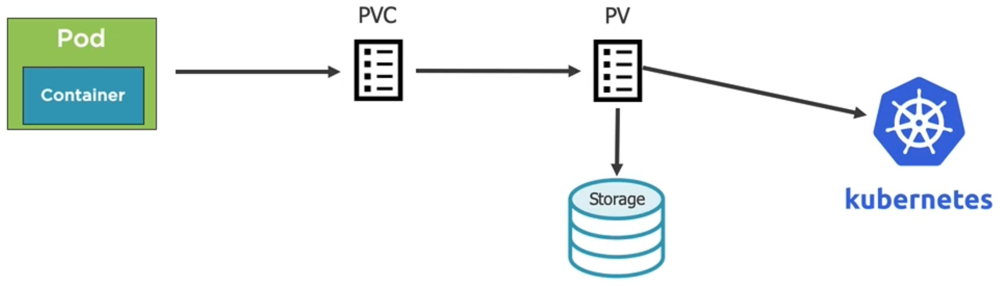

# [Storage Options](https://kubernetes.io/docs/concepts/storage/)

Pods being an ephemeral entity we need to think about the possibility of data persistence. In K8s that comes in the form of several storage options, especially Volumes. Volumes can be used for storing and using the data or state of the Pods and Containers. A Pod can have multiple Volumes attached to it. We'd learn about something called `mountPath` to access the Volumes from the Pods. In general K8s supports the following storage options.

- [Volumes](https://kubernetes.io/docs/concepts/storage/volumes/)
- [PersistentVolumes and PersistentVolumeClaims](https://kubernetes.io/docs/concepts/storage/persistent-volumes/)
- [StorageClasses](https://kubernetes.io/docs/concepts/storage/storage-classes/)

## [Volumes](https://kubernetes.io/docs/concepts/storage/volumes/)

Volumes in K8s are similar to that from the Docker and they must have unique names. They are attached to Pod and may or may not be tied to lifetime of the Pod depending on the type of the Volume. A Volume mount references the Volume by name and defines a `mountPath`. Following are some basic types of Volumes storage options, that we'd like to start with.

- `emptyDir` - Tied to the Pod's lifetime and used for storing transient data. It is usually used for storing some data among the Containers running in a Pod.
- `hostPath` - Pods mount into the host Node's file system. If there is a possibility for the Node getting out of scope the data is lost.
- `nfs` - A network file system share can be mounted into the Pod.
- `configMap/secret` - Although we'd learn about the ConfigMaps as concrete K8s objects later, they are a type of Volumes.
- [persistentVolumeClaims](https://kubernetes.io/docs/concepts/storage/persistent-volumes/#persistentvolumeclaims) - A PersistentVolumeClaim (PVC) is a request for storage by a user. It is similar to a Pod. Pods consume node resources and PVCs consume PersistentVolumes resources. Pods can request specific levels of resources (CPU and Memory). Claims can request specific size and [access modes](https://kubernetes.io/docs/concepts/storage/persistent-volumes/#access-modes).
- `Cloud` - It refers to a cluster-wide storage and big topic of its own, which we'd explore in due time.

Above list is by no means an exhaustive one for Volume types, which K8s supports. Often it comes down to the decision from the organization on, which type of Volume would be used in the cluster setup. But we can at least start with some basic types to have some understanding on, how they fit in to the declarative way of defining resources in K8s.

> An example of the `emptyDir` Volume. This is not an ideal example, rather it is intended to get the basic idea, of how we make use of Volumes in a declarative manner. This type of Volume has the lifetime of the Pod itself.

```yaml
apiVersion: v1
kind: Pod
metadata:
  name: my-nginx
  labels:
    name: my-nginx
spec:
  volumes: # Defines a Volume
    - name: html # Defines initial Volume name as html
      emptyDir: {} # It is an empty directory having the lifetime of the Pod itself
  containers:
    - name: my-nginx
      image: nginx:alpine
      volumeMounts: # Mounts to the defined Volume at the Container level
        - mountPath: /usr/share/nginx/html # Defines a mountPath referring to the html volume
          name: html
          readOnly: true
      resources:
        limits:
          memory: "128Mi"
          cpu: "200m"
      ports:
        - containerPort: 80
    - name: html-updater
      image: alpine
      command: ["/bin/sh", "-c"]
      args:
        - while true; do date >> /html/index.html; sleep 10; done # Defines an update schedule for a file
      volumeMounts: # Mounts to the defined Volume at the Container level
        - mountPath: /html # Also defines a mountPath referring to the same html volume
          name: html
      resources:
        limits:
          memory: "128Mi"
          cpu: "200m"
```

> An example of the `hostPath` Volume. This is not an ideal example, rather it is intended to get the basic idea, of how we make use of Volumes in a declarative manner. This type of Volume has the lifetime of the Node, in which the Pod is hosted.

```yaml
apiVersion: v1
kind: Pod
metadata:
  name: docker
  labels:
    name: docker
spec:
  volumes: # Defines a Volume
    - name: docker-socket
      hostPath: # Specify, that the Volume is of type host path i.e. at the Node level
        path: /var/run/docker.sock
        type: Socket # It is socket type reference to get hold of the Docker daemon running at the Node level
  containers:
    - name: docker
      image: docker
      command: ["sleep"] # We could run Docker command at this point referring to the Docker daemon of the host if we want it
      args: ["1000"]
      resources:
        limits:
          memory: "128Mi"
          cpu: "200m"
      volumeMounts: # Mounts to the Volume
        - mountPath: /var/run/docker.sock
          name: docker-socket
```

> Example of the Cloud Volumes. These type of Volumes are much more reliable. They most often depend on, what kind of purpose we want to serve and the decision of the organization. Some examples of cloud volume providers are, Azure (Azure Disk and Azure File), AWS (Elastic Block Store), GCP (GCE PErsistent Disk) etc..

```yaml
apiVersion: v1
kind: Pod
metadata:
  name: my-pod
  labels:
    name: my-pod
spec:
  volumes:
    - name: data
      azureFile:
        secretName: <azure-secret>
        shareName: <share-name>
        readOnly: false
  containers:
    - name: my-pod
      image: my-image
      resources:
        limits:
          memory: "128Mi"
          cpu: "200m"
      volumeMounts:
        - mountPath: /data/storage
          name: data
```

```yaml
apiVersion: v1
kind: Pod
metadata:
  name: my-pod
  labels:
    name: my-pod
spec:
  volumes:
    - name: data
      awsElasticBlockStore:
        volumeID: <volume-id>
        fsType: ext4
  containers:
    - name: my-pod
      image: my-image
      resources:
        limits:
          memory: "128Mi"
          cpu: "200m"
      volumeMounts:
        - mountPath: /data/storage
          name: data
```

```yaml
apiVersion: v1
kind: Pod
metadata:
  name: my-pod
  labels:
    name: my-pod
spec:
  volumes:
    - name: data
      gcePersistentDisk:
        pdName: data-storage
        fsType: ext4
  containers:
    - name: my-pod
      image: my-image
      resources:
        limits:
          memory: "128Mi"
          cpu: "200m"
      volumeMounts:
        - mountPath: /data/storage
          name: data
```

Before going ahead with other concepts let's see some of these basic Volume types in action.

```bash
# We are running the same emptyDir example, that we saw above. We have an html reader Container and an writer Container. So the writer writes the current date time stamp on the html file and the reader reads the html file.

$ k create -f fundamentals/Storage/vol_nginx_empty_dir.yaml --dry-run=client --validate=true
pod/nginx-alpine-volume created (dry run)

$ k apply -f fundamentals/Storage/vol_nginx_empty_dir.yaml
pod/nginx-alpine-volume created

$ k get po

NAME                  READY   STATUS    RESTARTS   AGE
nginx-alpine-volume   2/2     Running   0          22s

$ k port-forward pod/nginx-alpine-volume 8080:80
Forwarding from 127.0.0.1:8080 -> 80
Forwarding from [::1]:8080 -> 80

# And after some weight of few seconds now we see following output upon refreshing the browser window periodically.

# Thu May 5 05:24:30 UTC 2022 Thu May 5 05:24:40 UTC 2022 Thu May 5 05:24:50 UTC 2022 Thu May 5 05:25:00 UTC 2022 Thu May 5 05:25:10 UTC 2022 Thu May 5 05:25:20 UTC 2022 Thu May 5 05:25:30 UTC 2022 Thu May 5 05:25:40 UTC 2022 Thu May 5 05:25:50 UTC 2022 Thu May 5 05:26:00 UTC 2022 Thu May 5 05:26:10 UTC 2022
```

Moving on with the host path Volume example.

```bash
# We are using the same example of the host path Volume as above, where we have declared a Socket type Volume. Some other possibilities for the same are,
# DirectoryOrCreate
# Directory
# FileOrCreate
# File
# Socket
# CharDevice
# BlockDevice

$ k create -f fundamentals/Storage/vol_host_path_example.yaml --dry-run=client --validate=true
pod/docker created (dry run)

$ k apply -f fundamentals/Storage/vol_host_path_example.yaml
pod/docker created

$ k describe po/docker

...
Volumes:
  docker-socket:
    Type:          HostPath (bare host directory volume)
    Path:          /var/run/docker.sock
    HostPathType:  Socket
...
# And here we see somewhere down in the descriptive Pod specification the details of the Volume. Ideally, the Container has now got hold of the Docker daemon of the Node and we can run some Docker commands from the inside of the Container.

$ k exec po/docker -it -- sh

> docker --version
Docker version 20.10.14, build a224086

> docker ps -a
CONTAINER ID   IMAGE                          COMMAND                  CREATED          STATUS                      PORTS     NAMES
b5632fab570d   docker                         "sleep 1000"             4 minutes ago    Up 4 minutes                          k8s_docker_docker_default_9538a7f5-ac14-4ec8-9c20-9c25281b2f6a_0
c1ac30c6c864   k8s.gcr.io/pause:3.5           "/pause"                 4 minutes ago    Up 4 minutes                          k8s_POD_docker_default_9538a7f5-ac14-4ec8-9c20-9c25281b2f6a_0
85223d453c5e   2edf9c994f19                   "/kube-vpnkit-forwar…"   15 minutes ago   Up 15 minutes                         k8s_vpnkit-controller_vpnkit-controller_kube-system_8b5f58a4-b540-4cda-89a0-e2a1070cac21_404
...

> docker image ls
REPOSITORY                                                                   TAG                                                     IMAGE ID       CREATED         SIZE
docker.wdf.sap.corp:51022/com.sap.datahub.linuxx86_64/rbase                  3.2.10                                                  85475bcdf665   20 hours ago    2.64GB
docker.wdf.sap.corp:51022/com.sap.datahub.linuxx86_64/rbase                  3.2.9                                                   f0b7c6c16a61   7 days ago      2.63GB
docker.wdf.sap.corp:51022/com.sap.datahub.linuxx86_64/rbase                  2210.2.0                                                40678a030cf3   3 weeks ago     2.19GB
docker.wdf.sap.corp:51022/com.sap.datahub.linuxx86_64/rbase4                 2210.2.0                                                5721a6424510   3 weeks ago     2.21GB
...

# Now we are convinced, that we are really talking to the Docker daemon of the Node, which in this case is the same one of the host.

# As we understood, we can have host path Volumes referring to Directory and File in the Node (which in this example is the same as the host). So we have to understand, that if we go with host path volume as a demonstration in this example the directory / files would be stored at our host machine but their lifetime is really tied to the Node machine. Hence in a real cluster setup we have to make an educated decision.
```

## PersistentVolumes and PersistentVolumeClaims

[Persistent Volumes](https://kubernetes.io/docs/concepts/storage/persistent-volumes/) is a cluster-wide storage unit provisioned by an administrator. This storage unit is independent of the lifecycle of any Pod. Persistent Volumes are the objects representing the storage area and PersistentVolumeClaims are the requests to use the PersistentVolumes. Pods can access a given PersistentVolumes even if it gets rescheduled to a different Node. PersistentVolumes inherently rely upon network file system or cloud provided storage solutions.

Following is a set of general steps, in which a PersistentVolumes and PersistentVolumeClaims work usually.



1. Create/provision the network storage resource.
2. Define PersistentVolume for the created/introduced resource and register with the K8s API.
3. Create a PersistentVolumeClaim requesting for the PersistentVolume.
4. K8s binds the PersistentVolumeClaim to the specified PersistentVolume.
5. Bind the PersistentVolumeClaim to the Pod/Deployment template (YAML) to make use of the PersistentVolume.

GitHub page of [kubernetes/examples](https://github.com/kubernetes/examples) is a rich source for reference declarative K8s objects. Following is an example of declaring a PersistentVolume resource and registering it with K8s.

```yaml
apiVersion: v1
kind: PersistentVolume # Specify the object kind a PersistentVolume
metadata:
  name: my-pv # Name of the PersistentVolume
spec:
  capacity:
    storage: 10Gi # Define storage capacity
  accessModes:
    - ReadWriteOnce # Only once client can mount with read and write access
    - ReadOnlyMany # Many clients can mount for read access
  persistentVolumeReclaimPolicy: Retain # Specify, that even if the claim to this PersistentVolume disappears i.e., if the Pods go end of their lives the PersistentVolume would be retained with all the data in the storage
  azureFile: # Refer to the kind of storage to use
    secretName: <azure-secret>
    shareName: <name_from_azure>
    readOnly: false
```

Above YAML declaration enabled us to create the PersistentVolume and register with K8s but in order for Pods to actually use it we need yet another declaration for PersistentVolumeClaim. Following is an example for that.

```yaml
apiVersion: v1
kind: PersistentVolumeClaim # Specify the object kind as PersistentVolumeClaim
metadata:
  name: pv-dd-account-hdd-5g
  annotations:
    volume.beta.kubernetes.io/storage-class: acounthdd
spec:
  accessModes:
    - ReadWriteOnce # Define access mode. We specify from the perspective of a single Pod only one user can mount with read and write.
  resources:
    requests:
      storage: 5Gi # Request for a specific storage amount
```

Above declarative yaml registers a claim / request to the K8s API in order to mount to some PersistentVolume, that is previously defined. And finally we have to add the reference of the PersistentVolumeClaim to the Pod specification.

```yaml
apiVersion: v1
kind: Pod
metadata:
  name: pod-uses-account-hdd-5g
  labels:
    name: storage
spec:
  containers:
    - name: az-c-01
      image: nginx:alpine
      command:
        - /bin/sh
        - -c
        - while true; do echo $(date) >> /mnt/blobdisk/outfile; sleep 1; done
      volumeMounts: # Specifying the volume mount for the PersistentVolume
        - mountPath: /mnt/blobdisk
          name: blobdisk01
      resources:
        limits:
          cpu: "128Mi"
          memory: "200m"

  volumes:
    - name: blobdisk01 # We registering the PersistentVolumeClaim along with the Pod specification
      persistentVolumeClaim:
        claimName: pv-dd-account-hdd-5g
```

This somewhat gives us with an introductory idea of, how to use PersistentVolumes with K8s. However, as we understood before, that we have barely scratched the surface. There is yet another concept in K8s, which we have to understand before we can jump into some examples. That concept is StorageClasses.

## Storage Classes

[Storage Classes](https://kubernetes.io/docs/concepts/storage/storage-classes/) provide the administrators to describe different "classes/types" of storage they offer. Different classes might map to quality-of-service levels, or to backup policies, or to arbitrary policies determined by the cluster administrators. K8s does not dictate, what these classes should represent. This concept is sometimes called "profiles" in other storage systems.

From another perspective the definition of StorageClasses is an alternative to the way we mentioned above i.e. to provision a storage and register the same as PersistentVolume, Register a request to use the storage as PersistentVolumeClaim and finally mount the storage in the Pod specification using the PersistentVolumeClaim. This is inherently a static approach, where several detail about the storage e.g., its capacity is predefined before the Pods can make use of the same. StorageClasses on the other hand creates an option to dynamically provision the storage when needed using some kind of templates. The classes in this case distinguish themselves in terms of quality-of-service levels, backup polices or any arbitrary policies setup by the cluster administrators.

Each StorageClass contains some fields such as `Provisioner`, `Parameters`, and `ReclaimPolicy`. We'd learn about them eventually because they are central to the idea of sing StorageClasses. But first, we want to understand the most crucial distinction between the earlier method of using PersistentVolumes wth that of StorageClasses. We'd see, that StorageClasses as a concept also fits into the ideas concerning PersistentVolume and PersistentVolumeClaim.


1. We start by creating a StorageClass this time, which also has its own kind of YAML declaration.
2. Then comes the PersistentVolumeClaims declaration, which is linked with the StorageClass now. Eventually we'd see, that it binds to the PersistentVolume but happens dynamically as we see shortly. Main distinction here is, that previously we had to first create the PersistentVolume and then a claim could bind to it. Now we'd see, that PersistentVolumeClaim would be created first and linked to the StorageClass. PersistentVolume would then be provisioned dynamically.
3. `Provisioner` component of the StorageClass determines the type of the volume plugin to use the correct PersistentVolume. Once that's done a PersistentVolume is provisioned and bound to the previously define PersistentVolumeClaim.
4. Finally Pods can then make use of the PersistentVolume in the same manner previously explained.

Now, let's see some example declaration to create PersistentVolumes using StorageClasses.

```yaml
apiVersion: storage.k8s.io/v1 # Here the apiVersion reference is a bit different
kind: StorageClass # Object kind is StorageClass
metadata:
  name: local-storage # It is important to give a unique name to the StorageClass
provisioner: kubernetes.io/no-provisioner # This is one of the most important parts. This identifies the Volume plugin, which should be used to provision the PersistentVolume. In this case we are going with np-provisioner, which represents, that the PersistentVolume won't be created automatically. That means in effect this one is similar to the older approach. In order to enable the dynamic provisioning of PersistentVolumes we need to provide an appropriate plugin e.g., kubernetes.io/aws-ebs, kubernetes.io/azure-file, kubernetes.io/gce-pd etc..
reclaimPolicy: Retain # Specifies to retain the PersistentVolume after use
volumeBindingMode: WaitForFirstConsumer # This is self-explanatory. The PersistentVolume would be provisioned after the consumer of the same (some Pod) is created.
```

Since in the above example of StorageClass declaration we did not have a provisioner we'd need to provide the declaration of the PersistentVolume ourselves. Let's look at such a declaration, which uses the StorageClass above. In this example we'd use a specification called `nodeAffinity`, which we have not used in any of our examples until now. Also in this example we intend to store the data in one of the Nodes in the cluster and the `nodeAffinity` specification would select, which the Node it would be.

```yaml
apiVersion: v1
kind: PersistentVolume
metadata:
  name: my-pv
spec:
  capacity:
    storage: 10Gi
  volumeMode: Block
  accessModes:
    - ReadWriteOnce # We would alow one Pod to read from and one Pod to write to the storage
  storageClassName: local-storage # We specify, which StorageClass to use
  local:
    path: /data/storage # Path where the data should be stored on the Node
  nodeAffinity:
    required:
      nodeSelectorTerms: # Specifies the condition, based on which the Node would be selected
        - matchExpressions:
            - key: kubernetes.io/hostname
              operator: In # This is an in condition and it would be applied on the underlying values, which is a list. It means, if the hostname of a given Node matches any of the names in the values list, then the storage would be setup in that Node.
              values:
                - <node-name>
```

Next object to declare is the PersistentVolumeClaim, so that our Pod can request for the PersistentVolume resource. We need to remind ourselves once again, that in this example using StorageClass has no added advantage, since we have not specified any valid `provisioner`. Hence, we had to even declare the PersistentVolume ourselves.

```yaml
apiVersion: v1
kind: PersistentVolumeClaim
metadata:
  name: my-pvc
spec:
  accessModes:
    - ReadWriteOnce
  storageClassName: local-storage # This is the most notable piece here, where we have specified the StorageClass name.
  resources:
    requests:
      storage: 1Gi
```

With the PersistentVolumeClaim has been declared we finally can plug the same in the declaration of Pod, Deployment or other relevant resource declarations like below.

```yaml
apiVersion: v1
kind: [Pod | Deployment | StatefulSet]
---
spec:
  volumes:
    - name: my-volume
      persistentVolumeClaim:
        claimName: my-pvc
---
```

With this we now have some introductory idea on, how to use the PersistentVolume, PersistentVolumeClaim and StorageClasses. Now we'd like to take some examples to see these objects into action. Our examples would be small scale. However, in this example we have used a new K8s resource, [StatefulSet](https://kubernetes.io/docs/concepts/workloads/controllers/statefulset/), which we have not discussed in detail so far. It us used as an alternative to normal Pods. According to the definition it is a workload API object used to manage stateful applications. It manages the deployment and scaling of a set of Pods, and provides guarantees about the ordering and uniqueness of these Pods. Whats does this mean, that we would understand shortly, when we run the example. We'd create a group K8s resources in one go. The declarations for these resources are defined in one single file, which is taken from [this repository](https://github.com/DanWahlin/DockerAndKubernetesCourseCode/tree/main/samples/volumes/pv-pvc-sc-cm). We have also used a ConfigMap, which we'd learn more about shortly.

```bash
# This example defines the PersistentVolume in a way, that it stores the database file to a specified path on the Node. In our case, we are running the Docker-Desktop on macOS. Hence we have a local cluster with a single Node named "docker-desktop" with the current version of Docker. In order to run the example we first have to create the directory structure for the database, which we have provided as the local path for the PersistentVolume declaration e.g., /Users/I519774/workspace/personal/repos/k8s/tmp/data/db
# We have created this directory structure and now we can use `k apply` command to create the resources.

$ k apply -f fundamentals/Storage/mongo_storage_classes_example.yaml
configmap/mongo-env created
storageclass.storage.k8s.io/local-storage created
persistentvolume/mongo-pv created
persistentvolumeclaim/mongo-pvc created
service/mongo created
statefulset.apps/mongo created

$ k get all

NAME          READY   STATUS    RESTARTS   AGE
pod/mongo-0   1/1     Running   0          51s # First thing to notice is, that we have a more deterministic Pod name. This is the StatefulSet in action. Even if we go for replicas, we'd still have a predictable sequence here. We went for this approach in this example because we are running a database Pod.

NAME                 TYPE        CLUSTER-IP     EXTERNAL-IP   PORT(S)     AGE
service/kubernetes   ClusterIP   10.96.0.1      <none>        443/TCP     24d
service/mongo        ClusterIP   10.98.164.77   <none>        27017/TCP   51s

NAME                     READY   AGE
statefulset.apps/mongo   1/1     51s

# At this point we can also see, that the local file system location, which we designated as part of this example has files for MongoDB. Whatever database transaction we'd do, would be stored in the local file system of the Node, which in this case is the local machine.

$ k get pv # With this command we display the PersistentVolume, which does not show up with the k get all command, because this is a different kind of resource.
NAME       CAPACITY   ACCESS MODES   RECLAIM POLICY   STATUS   CLAIM               STORAGECLASS    REASON   AGE
mongo-pv   1Gi        RWO            Retain           Bound    default/mongo-pvc   local-storage            6m59s

# The RECLAIM_POLICY = Retain denotes, that even when we delete the K8s resources the local file system mapping would be retained.

$ k delete -f fundamentals/Storage/mongo_storage_classes_example.yaml
configmap "mongo-env" deleted
storageclass.storage.k8s.io "local-storage" deleted
persistentvolume "mongo-pv" deleted
persistentvolumeclaim "mongo-pvc" deleted
service "mongo" deleted
statefulset.apps "mongo" deleted

# Above operation did not delete the files created in the local file system
```

In the example above we used a K8s object called ConfigMap, which is meant to store configuration details for K8s resources. As a next step we'd learn bit more about, how that is used in K8s.
